# <strong>Winlogbeat</strong>  

winlogbeat는 윈도우에 설치하여 로그를 ES와 Logstash에 전송한다.  

<strong>Step 1. Install Winlogbeat</strong>

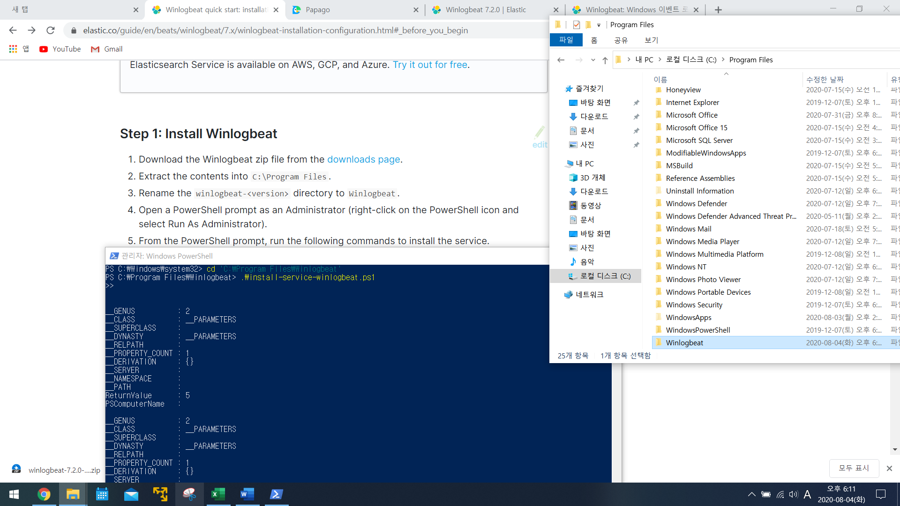  

Winlogbeat 7.2버전을 다운로드하여 C:\Program File에 압축 해제 및 폴더명을 Winlogbeat로 변경하고 파워쉘의 관리자 권한으로 서비스를 설치한다.  

<strong>Step 2. Connect to the Elastic Stack</strong>  

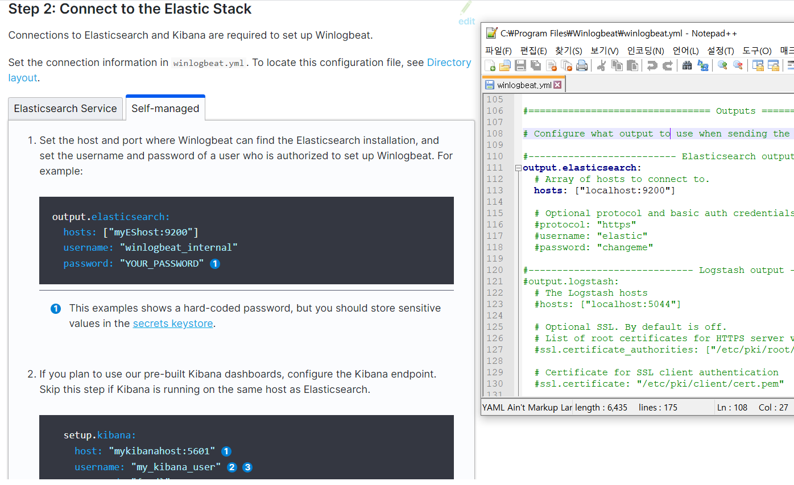

<strong>Step 3. Configure Winlogbeat</strong>  

원하는 로그 구성을 설정하고 loging할 옵션도 설정 후 설정을 저장 및 test를 실행  
```
PS C:\Program Files\Winlogbeat> .\winlogbeat.exe test config -c .\winlogbeat.yml -e 
```
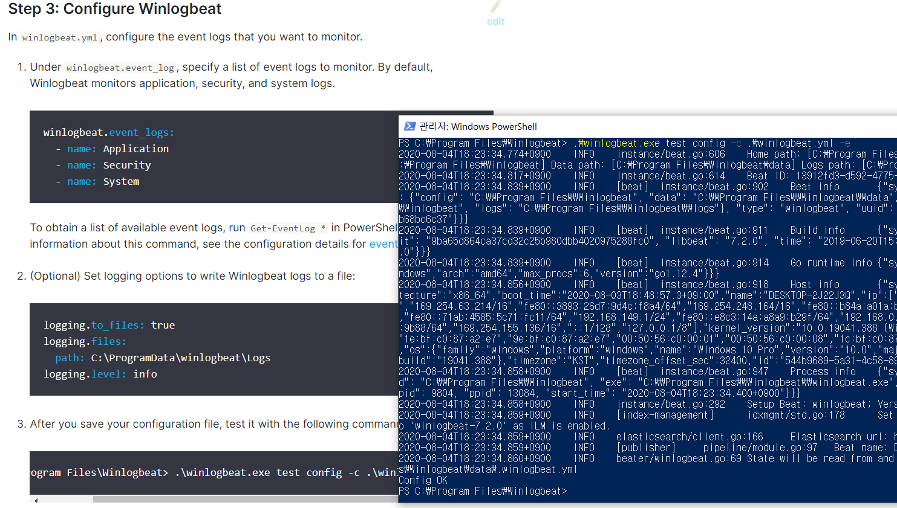  

<strong>Step 4. Set up assets</strong>  

Winlogbeat에서 데이터의 구문 분석과 색인, 시각화를 위해 미리 정의된 asset을 로드하려면  

```
PS > .\winlogbeat.exe setup -e
```

<strong>Step 5. Start Winlogbeat </strong>  

```
PS C:\Program Files\Winlogbeat> Start-Service winlogbeat
```
해당 명령어로 Winlogbeat 서비스를 시작

Winlogbeat가 실행중이고 로깅 설정을 사용한 경우 

C:\ProgramData\winlogbeat\Logs\winlogbeat. 이 위치에서 로그 파일을 볼 수 있다.

```
PS C:\Program Files\Winlogbeat> Stop-Service winlogbeat
```
위 명령어로 Winlogbeat 서비스 종료

<strong>Step 6. View your data in Kibana</strong>

Point your browser to http://localhost:5601, replacing localhost with the name of the Kibana host.
인덱스 패턴을 설정하고 로그를 확인

---

 _인덱스 패턴에 winlogbeat가 나타나지 않는다. (저번 nxlog처럼 IP설정 문제인가? winlogbeat도 filebeat처럼 서버 컴퓨터 ubuntu 환경에 설치되어야 하는가?)_

 ---

 ***
 ***
 # Sysmon 설치
 Sysmon을 더 유용하게 사용하기 위해서는 config 파일을 이용하여야 한다. 직접 설정하는 방법도 있으나 이미 github를 이용해 공개된 Sysmon config파일을 이용하는 방법을 추천한다. 부족한 부분은 제외하고 추가할 부분을 추가하여 설정이 가능하다.

 설정 파일은 공개된 github(https://github.com/SwiftOnSecurity/sysmon-config)에서 다운로드 하였다.

 설치 명령은 다음과 같다.
 ```
 Sysmon64.exe -accepteula -i C:\Users\Administrator\Desktop\Sysmon\sysmonconfig-export.xml -l -n
 ```
 수정 후

 ```
 수정 : Sysmon64.exe -c sysmonconfig-export.xml
 ```
 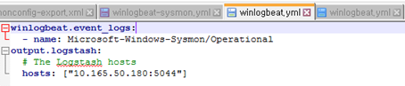

 이후 winlogbeat.yml파일을 위와 같이 host를 서버 IP로 설정하고 winlogbeat 설정 변경 후 서비스를 시작하면

 __powershell에서 지속적인 로그 모니터링(?)__
 ```
 .\winlogbeat.exe -c .\winlogbeat.yml -e
 ```
 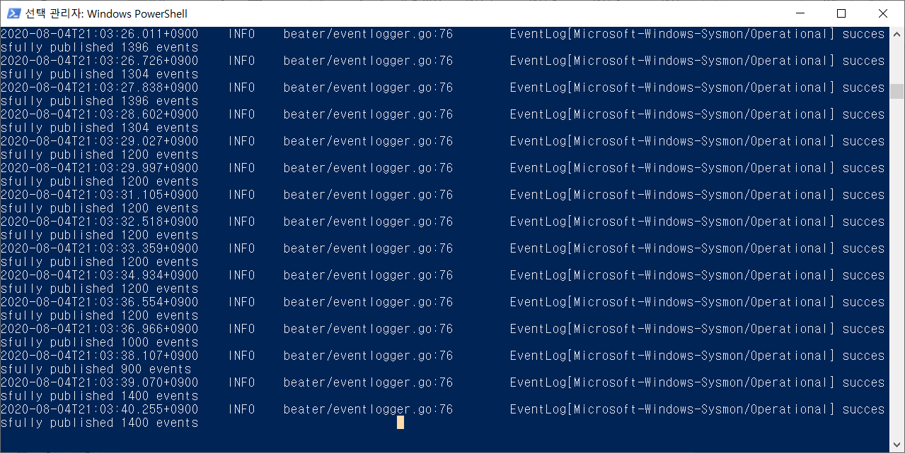
 
 지속적인 로그생성이 실시간으로 되는 것(?) 같다.
 

 이후 logstash설정으로 해당 로그에 맞는 필터링을 위 사이트와 동일하게 설정하고 모든 서비스를 설정 후 확인해보겠다.

 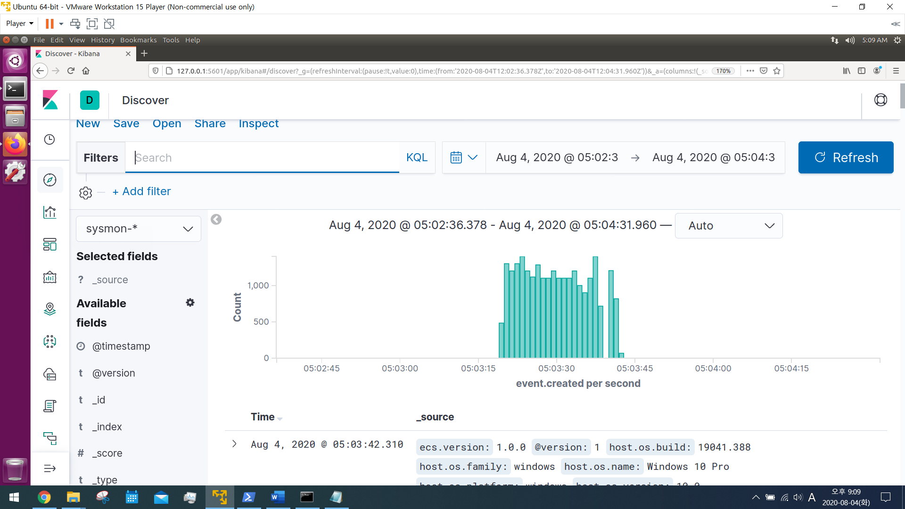

 인덱스 패턴으로 Time Filter field name: event.created 으로 설정하여 우분투에 설정된 시간과 동일하게 나오는 것 같다. 하지만 윈도우 시간과 다르므로 다른 케이스로 인덱스 패턴을 설정해 보겠다.

 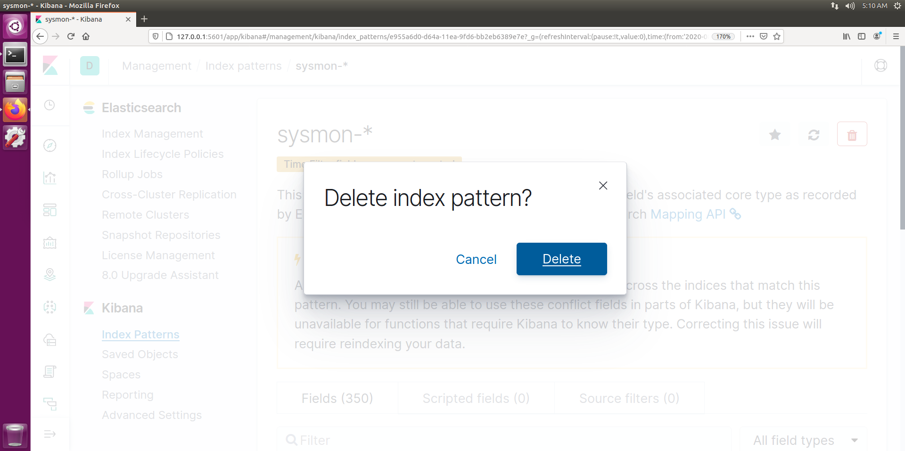

 sysmon에 해당하는 인덱스 패턴 제거
 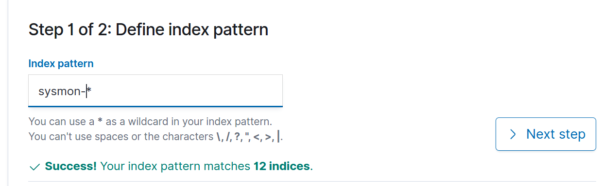

 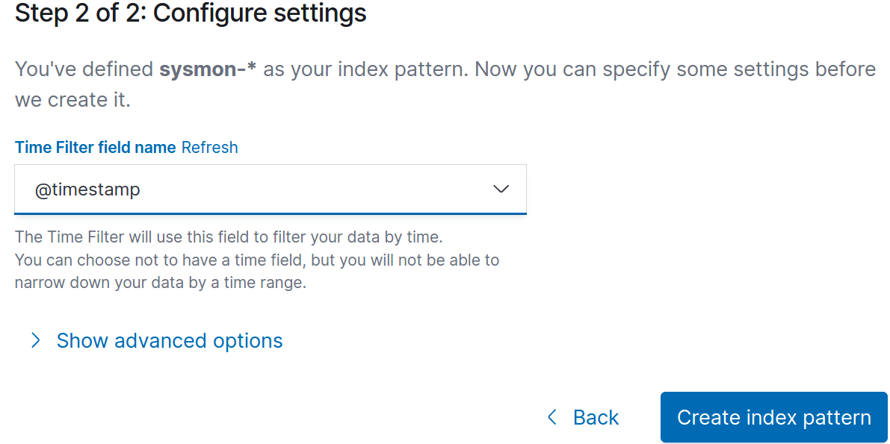

 이번엔 @timestamp로 시간설정

 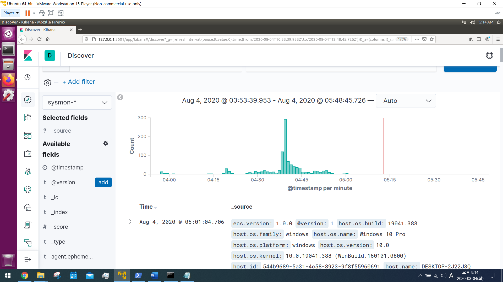

 예상 : 내 컴퓨터(Window)에 설정된 시간의 로그로 설정이 될 줄 알았으나 위의 케이스와 차이점으로 log가 발생된 시점을 기준으로 로그 데이터가 출력되는 것 같다.

 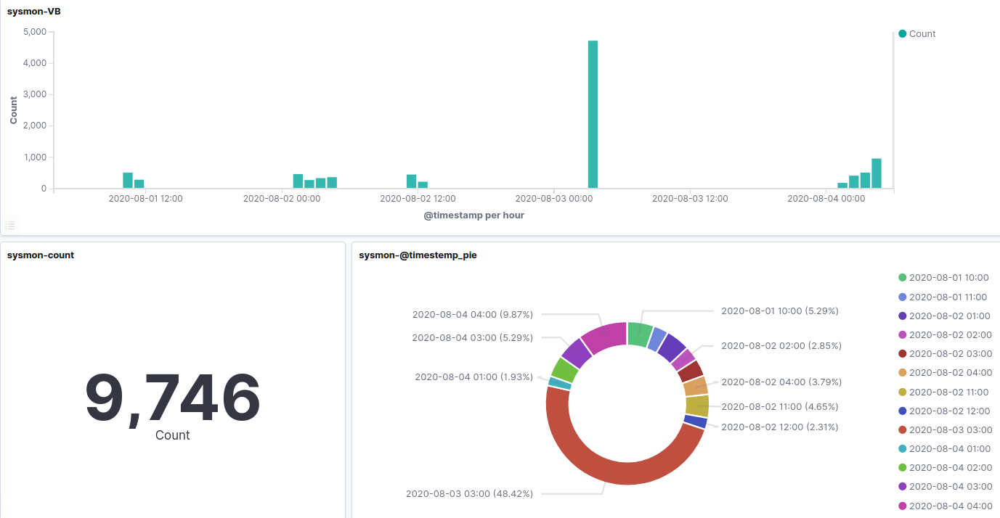

 해당 로그를 활용하여 내 window에서 log발생 시점을 기준으로 언제 가장 많은 log가 발생한지 시간대와 개수를 확인할 수 있었다.

 winlogbeat 서비스 종료 후 다시 시작 후 대쉬보드 확인
 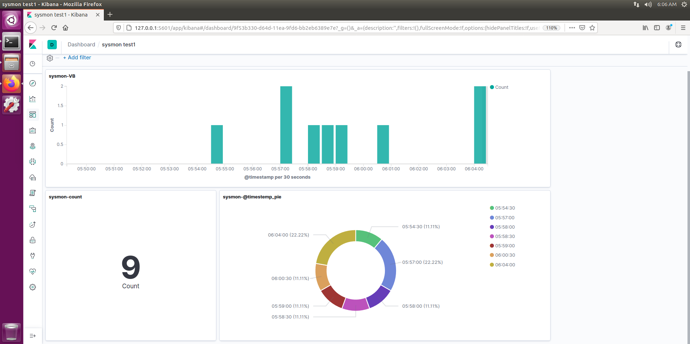

 예상 : 대시보드 출력 과정 스캔한 시간대가 변경되어 변경된 시간대의 로그 카운트가 출력이 된 것 같다.
___

 새벽에 팀원 도움을 위해 디스코드로 정보 공유중 discord 로그 실시간 기록된 것 확인!
 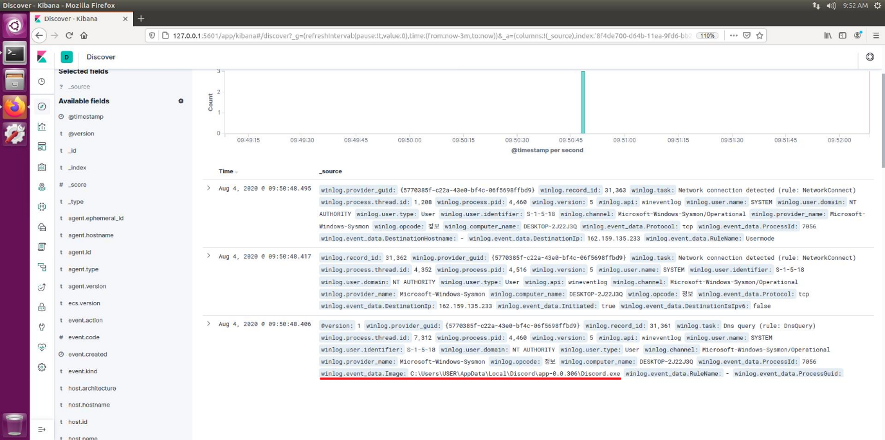

 디스코드 사용으로 로그가 출력된 것을 확인하여 필터링 과정으로 원하는 로그를 거르고 시각화를 통해 프로젝트에 사용될 몰입도 설정이 가능할 것 같다.
 

 winlogbeat.yml
 ```
 ###################### Winlogbeat Configuration Example ########################

# This file is an example configuration file highlighting only the most common
# options. The winlogbeat.reference.yml file from the same directory contains
# all the supported options with more comments. You can use it as a reference.
#
# You can find the full configuration reference here:
# https://www.elastic.co/guide/en/beats/winlogbeat/index.html

#======================= Winlogbeat specific options ===========================

# event_logs specifies a list of event logs to monitor as well as any
# accompanying options. The YAML data type of event_logs is a list of
# dictionaries.
#
# The supported keys are name (required), tags, fields, fields_under_root,
# forwarded, ignore_older, level, event_id, provider, and include_xml. Please
# visit the documentation for the complete details of each option.
# https://go.es.io/WinlogbeatConfig
winlogbeat.event_logs:
 
  - name: Microsoft-Windows-Sysmon/Operational
    
logging.to_files: true
logging.files:
  path: C:\ProgramData\winlogbeat\Logs
logging.level: info
#==================== Elasticsearch template settings ==========================

setup.template.settings:
  index.number_of_shards: 1
  #index.codec: best_compression
  #_source.enabled: false


#================================ General =====================================

# The name of the shipper that publishes the network data. It can be used to group
# all the transactions sent by a single shipper in the web interface.
#name:

# The tags of the shipper are included in their own field with each
# transaction published.
#tags: ["service-X", "web-tier"]

# Optional fields that you can specify to add additional information to the
# output.
#fields:
#  env: staging


#============================== Dashboards =====================================
# These settings control loading the sample dashboards to the Kibana index. Loading
# the dashboards is disabled by default and can be enabled either by setting the
# options here or by using the `setup` command.
#setup.dashboards.enabled: false

# The URL from where to download the dashboards archive. By default this URL
# has a value which is computed based on the Beat name and version. For released
# versions, this URL points to the dashboard archive on the artifacts.elastic.co
# website.
#setup.dashboards.url:

#============================== Kibana =====================================

# Starting with Beats version 6.0.0, the dashboards are loaded via the Kibana API.
# This requires a Kibana endpoint configuration.
#setup.kibana:

  # Kibana Host
  # Scheme and port can be left out and will be set to the default (http and 5601)
  # In case you specify and additional path, the scheme is required: http://localhost:5601/path
  # IPv6 addresses should always be defined as: https://[2001:db8::1]:5601
  host: "192.168.149.128:5601"

  # Kibana Space ID
  # ID of the Kibana Space into which the dashboards should be loaded. By default,
  # the Default Space will be used.
  #space.id:

#============================= Elastic Cloud ==================================

# These settings simplify using winlogbeat with the Elastic Cloud (https://cloud.elastic.co/).

# The cloud.id setting overwrites the `output.elasticsearch.hosts` and
# `setup.kibana.host` options.
# You can find the `cloud.id` in the Elastic Cloud web UI.
#cloud.id:

# The cloud.auth setting overwrites the `output.elasticsearch.username` and
# `output.elasticsearch.password` settings. The format is `<user>:<pass>`.
#cloud.auth:

#================================ Outputs =====================================

# Configure what output to use when sending the data collected by the beat.

#-------------------------- Elasticsearch output ------------------------------
#output.elasticsearch:
  # Array of hosts to connect to.
  hosts: ["192.168.149.128:9200"]

  # Optional protocol and basic auth credentials.
  #protocol: "https"
  #username: "elastic"
  #password: "changeme"

#----------------------------- Logstash output --------------------------------
output.logstash:
  # The Logstash hosts
  hosts: ["192.168.149.128:5044"]

  # Optional SSL. By default is off.
  # List of root certificates for HTTPS server verifications
  #ssl.certificate_authorities: ["/etc/pki/root/ca.pem"]

  # Certificate for SSL client authentication
  #ssl.certificate: "/etc/pki/client/cert.pem"

  # Client Certificate Key
  #ssl.key: "/etc/pki/client/cert.key"

#================================ Processors =====================================

# Configure processors to enhance or manipulate events generated by the beat.

processors:
  - add_host_metadata: ~
  - add_cloud_metadata: ~

#================================ Logging =====================================

# Sets log level. The default log level is info.
# Available log levels are: error, warning, info, debug
#logging.level: debug

# At debug level, you can selectively enable logging only for some components.
# To enable all selectors use ["*"]. Examples of other selectors are "beat",
# "publish", "service".
#logging.selectors: ["*"]

#============================== Xpack Monitoring ===============================
# winlogbeat can export internal metrics to a central Elasticsearch monitoring
# cluster.  This requires xpack monitoring to be enabled in Elasticsearch.  The
# reporting is disabled by default.

# Set to true to enable the monitoring reporter.
#monitoring.enabled: false

# Uncomment to send the metrics to Elasticsearch. Most settings from the
# Elasticsearch output are accepted here as well.
# Note that the settings should point to your Elasticsearch *monitoring* cluster.
# Any setting that is not set is automatically inherited from the Elasticsearch
# output configuration, so if you have the Elasticsearch output configured such
# that it is pointing to your Elasticsearch monitoring cluster, you can simply
# uncomment the following line.
#monitoring.elasticsearch:

#================================= Migration ==================================

# This allows to enable 6.7 migration aliases
#migration.6_to_7.enabled: true
```