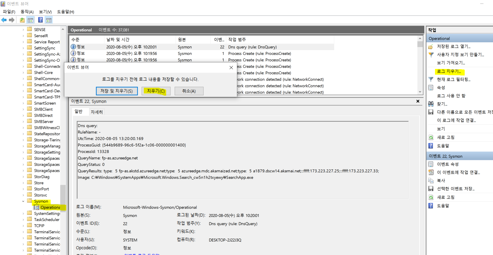
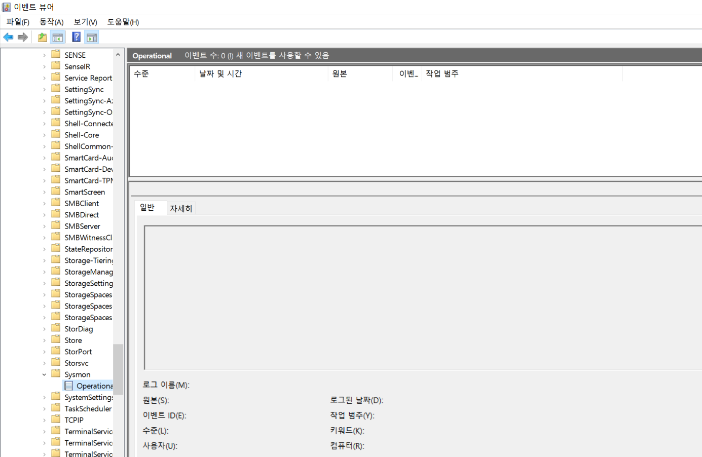
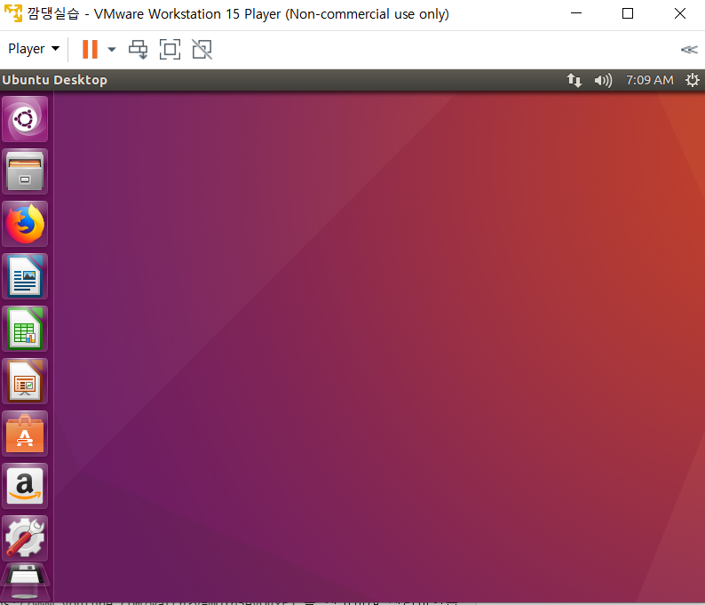

# 이벤트로그와 winlogbeat

* ___주경진 학습 내용 실습___


## 이벤트 뷰어

```
Get-WinEvent -ListLog * | Measure-Object -Line
```
해당 명령어를 사용하면 총 로그 항목을 확인 할 수 있다.


제 실습 환경에서는 431개를 확인 할 수 있다.

## 쌓인 로그 지우기



이후 결과


____

__이후 실습은 [유튜브 실습](https://www.youtube.com/watch?v=MQ1b5eyQgxE) 를 참고하여 진행하였습니다.__


* 새로운 가상 환경을 활용하여 실습 진행(jdk나 elk설치도 안됨)

```
sudo apt-get install default-jdk
wget https://artifacts.elastic.co/downloads/kibana/kibana-7.2.0-amd64.deb
wget https://artifacts.elastic.co/downloads/elasticsearch/elasticsearch-7.2.0-amd64.deb


```


git 커맨드 실행을 위한 install git에 문제로 위와 같이 설정

```
sudo apt install git
sudo git clone https://github.com/justmeandopensource/elk
cd elk/docker/
sudo mv docker-compose-v7.1.1.yml docker-compose.yml 
```
로 docker-compose 하나만 docker에 yml파일로 저장되어 있는 상황


[도커 설치 링크](https://blog.cosmosfarm.com/archives/248/%EC%9A%B0%EB%B6%84%ED%88%AC-18-04-%EB%8F%84%EC%BB%A4-docker-%EC%84%A4%EC%B9%98-%EB%B0%A9%EB%B2%95/)


[도커 컴포즈 설치 링크](https://soyoung-new-challenge.tistory.com/73)

```
sudo systemctl start docker
sudo systemctl status docker
sudo docker-compose up -d
sudo docker-compose ps
```


이후 winlogbeat 설정
```
PS cd "C:\Program Files\Winlogbeat"
PS 
```

```
setup.dashboards.enabled: true
setup.kibana:  
      host: "192.168.149.130:5601"
output.elasticsearch:
    hosts: ["192.168.149.130:9200"]
```
이후 winlogbeat 시작 이후 키바나로 접속


