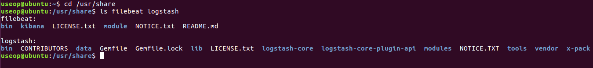
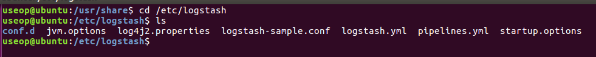
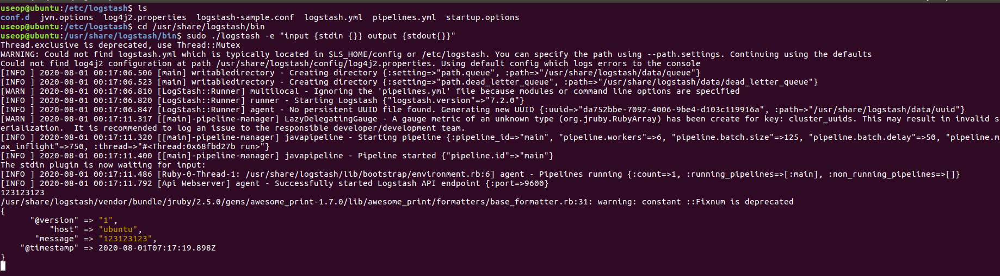
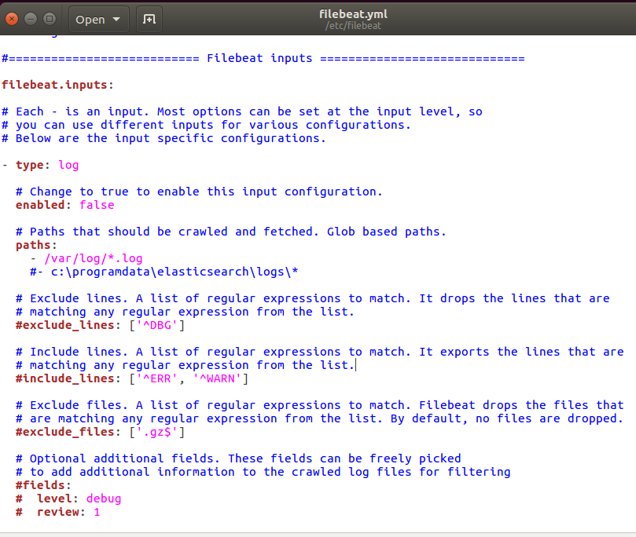
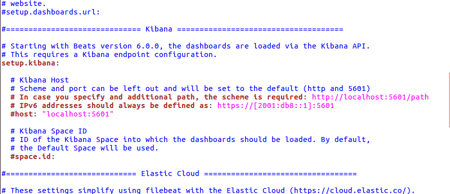
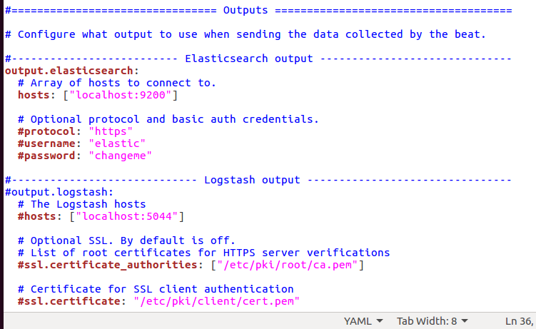
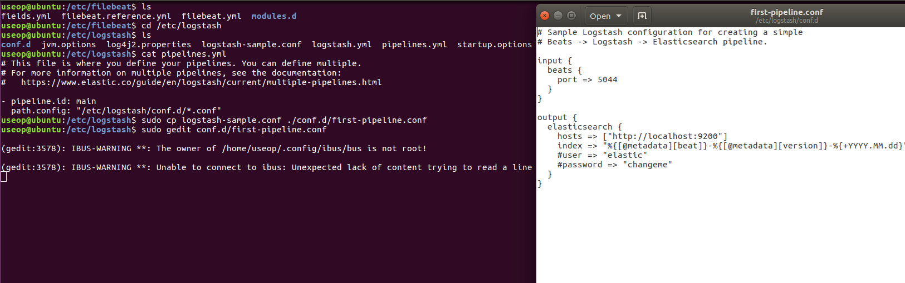

# 로그스태시를 활용한 로그 통합

키바나의 시각화과정 전에 자동화로 로그를 수집하는 logstash

filebeat와 logstash 설치 경로

설정 파일 위치

logstash로 원하는 데이터를 보내고 출력하는 방식으로 사용

inputs이므로 다수의 키가 사용이 가능

enabled : true로 설정하여 동작을 시킬 수 있다.

paths : 여기에 있는 로그를 가져온다.

키바나는 filebeat에 내장되어 대쉬보드를 꾸미고 싶은 경우 localhost의 정보를 통해 가능하다. 

elasticsearch와 직접 연결하지 않기 때문에 주석처리

logstash output을 활성화 한다.

거의 대부분이 5044의 포트를 활용하기 때문에 host처리

logstash의 pipeline yml파일에 conf의 설정파일로 해당 설정
예제 샘플에 input과 output이 미리 설정
