# 윈도우 이벤트 통합 로그 Sysmon활용법과 ELK 

window 로그 (x) < - > 리눅스 로그 (o)

 시스템 모니터(Sysmon)

Windows 시스템 서비스 및 장치 드라이버로 윈도우 시스템 전체를 관리(커널 영역에서 돌아가기 때문에 user영역의 sw는 커널 영역의 sw를 막기 힘들다.)

커널단까지 로그를 남길 수 있어 굉장히 유용한 기능을 제공한다.

시스템에 설치된 이후 서비스가 계속된다. window 이벤트 로그에 기록하여 호환성이 좋다.

ELK와 같은 로그를 실시간으로 각각의 클라이언트를 수집하여 모니터링하기에 좋다.

sysmon은 생성되는 이벤트의 분석을 제공하지 않는다(분석을 시각화 하는 툴kibana와 같은 분석 툴로는 제공되는 서비스가 없다.)

이전 서비스에서는 공격자로 sysmon을 숨길 수 없었지만 최근 업데이트로 sysmon을 공격자로부터 숨길 수 있다.

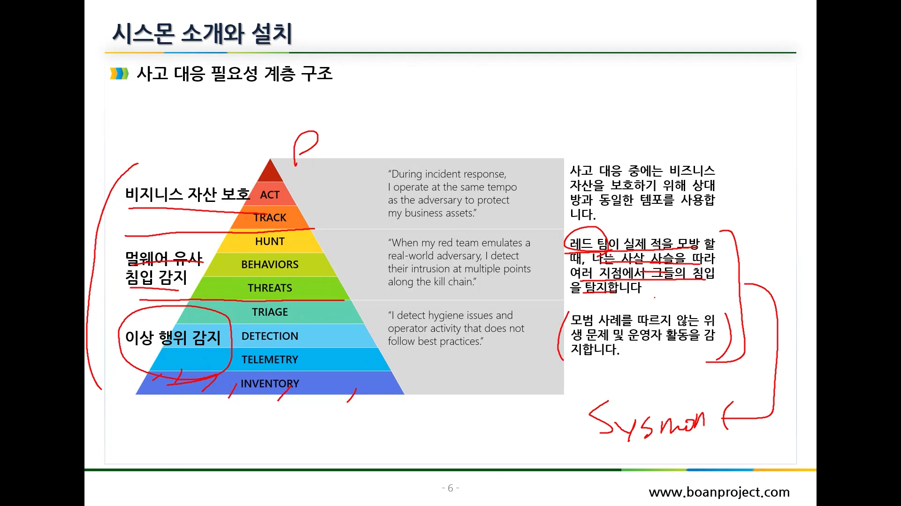

프로세스 및 파일의 해시를 남기기 어려운 것을 sysmon에서는 내부적으로 해시를 남겨 알려진 침입을 방어할 수 있다.

윈도우 이벤트 수집 환경이 쉽게 통합이 가능하고 프로세스 생성과 네트워크 연결을 로그로 데이터 저장.

 
1번부터 22번 로그까지 다 남기기 어렵다.(용량이 너무 커진다.) 

사용자가 필터링 툴을 이용하여 동적으로 특정 이벤트 로그를 활용

__Sysmon 특징__

명령어 옵션까지 포함하여 전체 명령 줄을 사용하여 프로세스 생성을 기록

윈도우의 pid를 다시 사용하더라도 연계하여 group의 id를 기록하여 기록한다.

선택적으로 네트워크 연결에 상세한 세션들의 로그를 기록

특정 이벤트를 동적으로 포함 및 제외를 시키는 필터링 가능

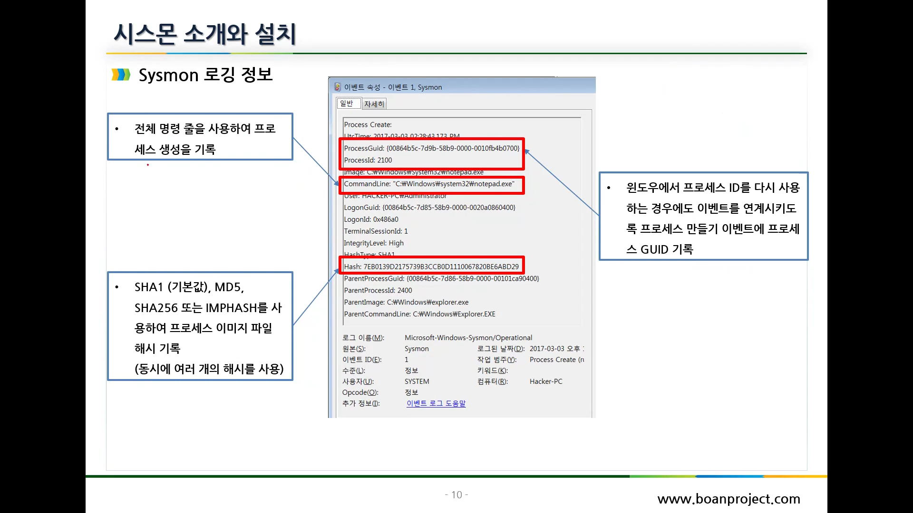

CommandLine : 전체 명령 줄을 사용하여 프로세스 생성을 기록

Process id 및 Guid : 이벤트를 연계시키기 위해 그룹 아이디도 기록

Hash : 프로세스 이미지파일의 해시를 기록

 
__Sysmon 로깅 설정__

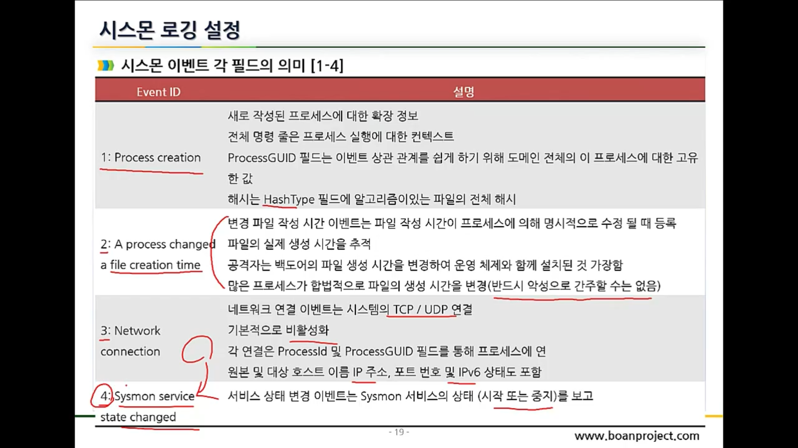

Event ID 4는 악의적인 종료를 탐지할 수 있다.

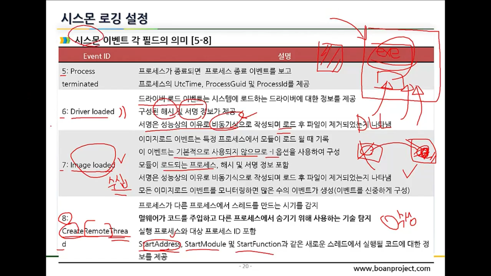

Event ID 7번 이미지 로드는 exe파일을 실행하거나 DLL 등 다양한 범주를 갖고 프로세스의 생성과 같은 로그

Event ID 8번 원격으로 쓰레드를 만드는 시기를 탐지하여 악성 코드 탐지에 중요하다.

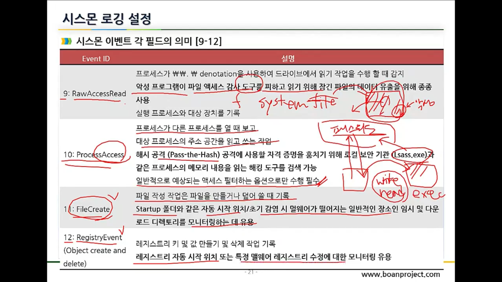

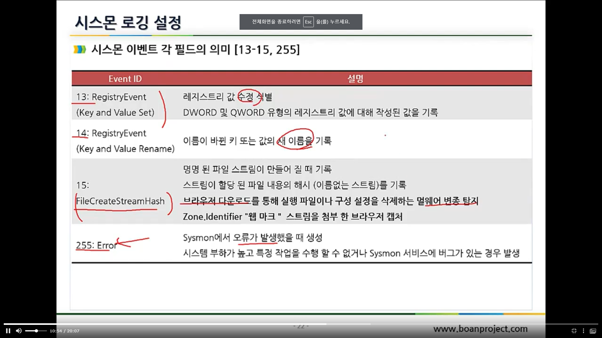

1

wmi : 윈도우에서 관리를 쉽게 하기 위해 인터페이스를 제공(API) 

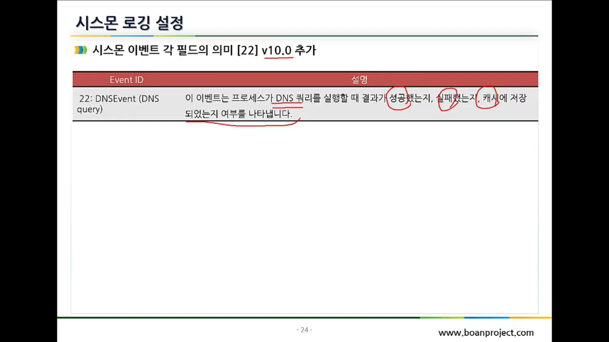

16번은 중간에 삭제된 event 로깅이다

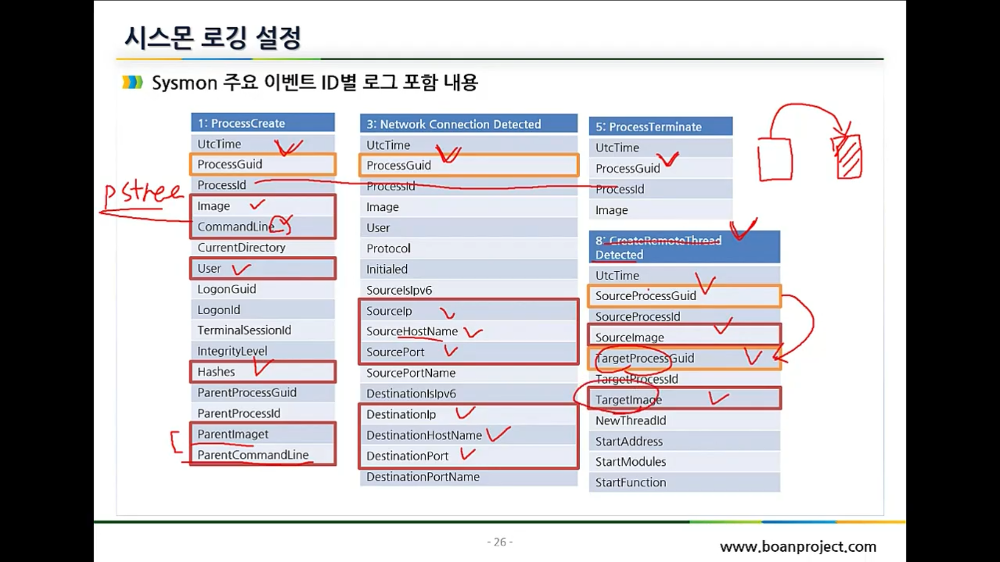

pguid를 통해 프로세스의 상태를 지속적으로 추적할 수 있도록 저장

parent의 정보도 저장하여 비활성화된 정보도 활성화된 정보를 통해 추적이 가능하다.

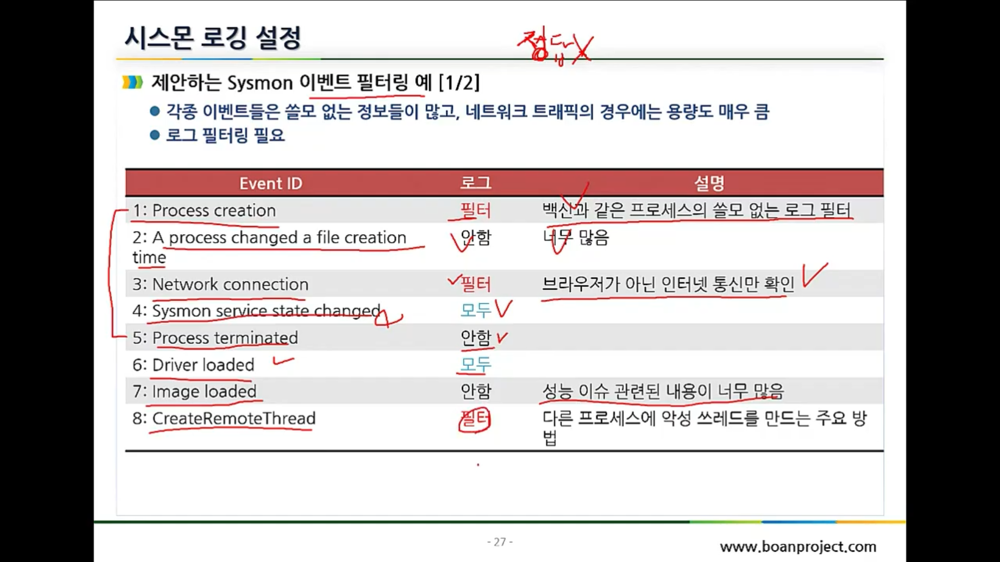

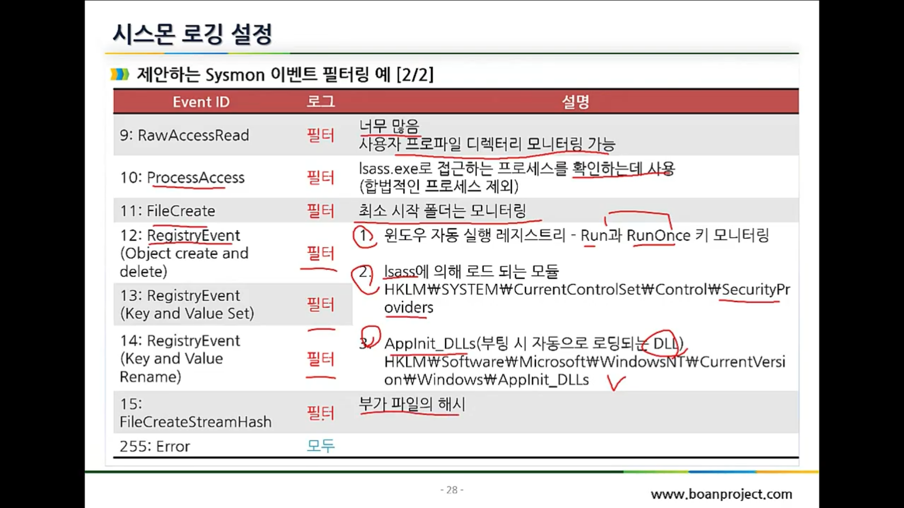

필터링 설정 파일 작성

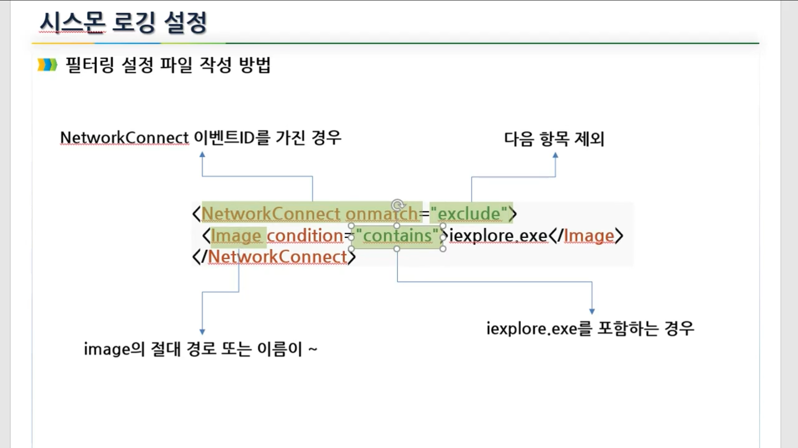

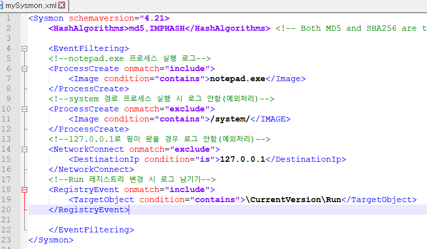

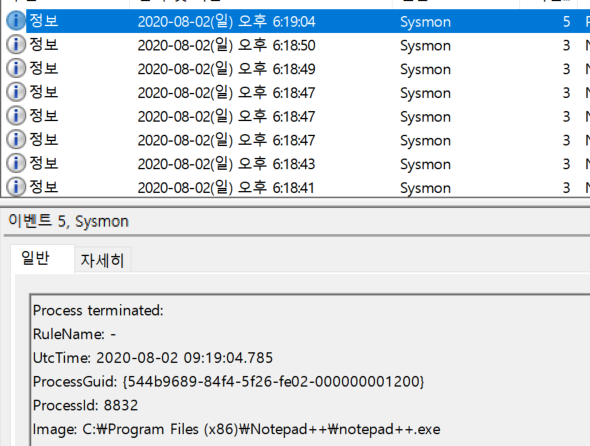

notepad 실행 종료시 로그 기록 결과 화면

# 시스몬 툴즈 소개와 설치
SysmonTools : SysmonView와 SysmonShell로 이루어진 툴

Sysmon 관련된 프로그램 중 가장 쉬움

SysmonShell – 간단한 GUI로 룰과 같은 SysmonXML구성을 작성에 도움을 주는 툴, Sysmon 로그를 내보내는 기능으로 XML파일로 내보내기가 가능, 어떤 이벤트들을 XML로 정리해주는 프로그램, 로그를 export기능

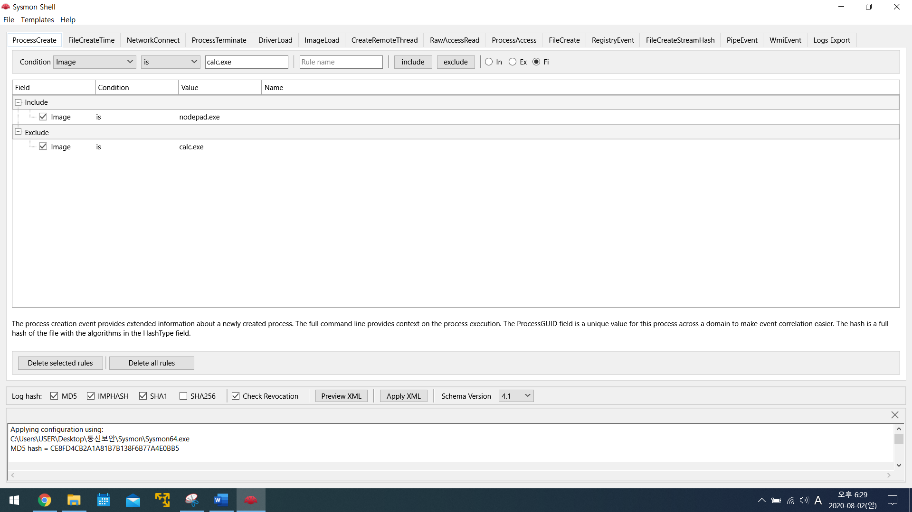

sysmonshell로 원하는 필터링을 설정하고 sysmon에 apply를 활용하여 사용

SysmonView – 실행 파일 이름, 세션 GUID 또는 이벤트 시간 및 프로세스 로그를 추적 및 시각화

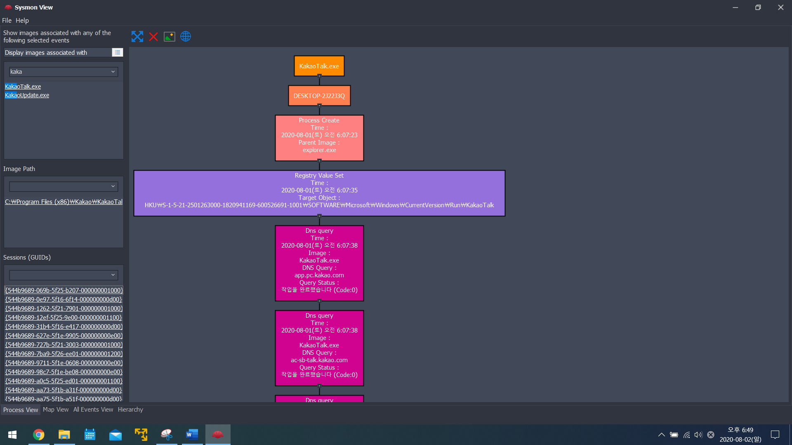

setup file과 같은 경우 관리자 권한으로 실행 시 같은 파일의 로직이여도 새로운 프로세스를 생성해서 활용된다.
