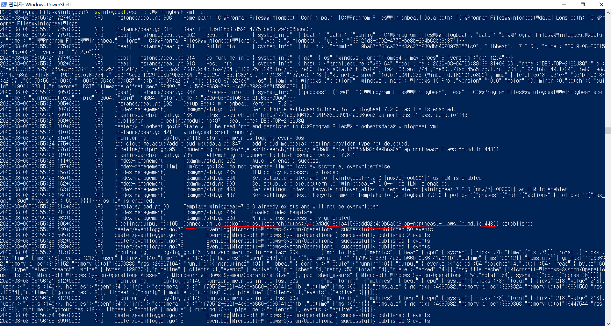
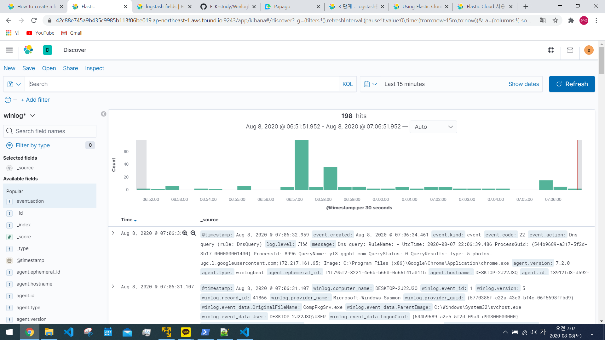
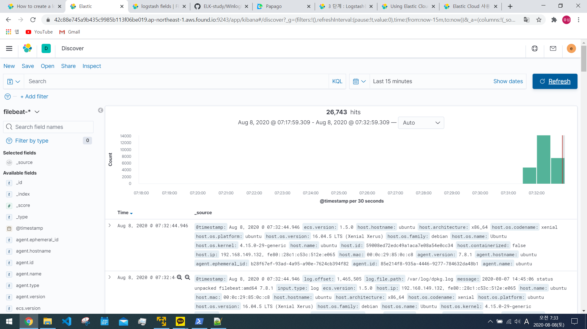
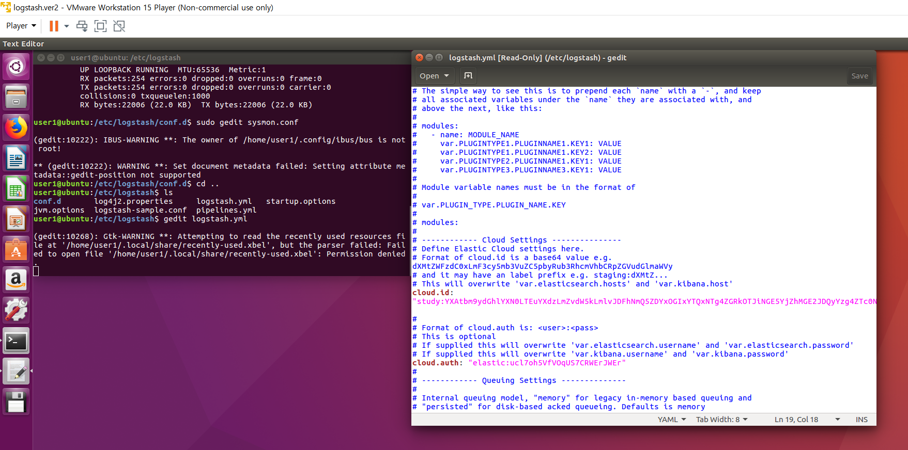
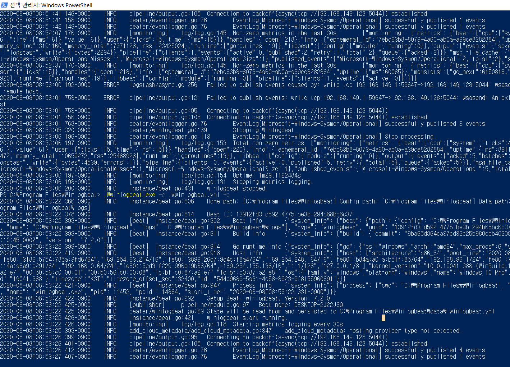

# Winlogbeat를 사용하여 Elastic Cloud(EC)에 로그 데이터 전송

___주경진 아이디의 서버로된 EC에 데이터 전송___

1. 직접 host를 입력하여 전송

winlogbeat.yml파일 설정 변경하여 데이터 전송
```
# ------------------------------ Logstash Output -------------------------------
output.elasticsearch:
  hosts:
    [
      "https://주어진 서버.aws.found.io:포트번호",
    ]
  protocol: "https"
  username: "elastic"
  password: "패스워드"
# Optional SSL. By default is off.
# List of root certificates for HTTPS server verifications
#ssl.certificate_authorities: ["/etc/pki/root/ca.pem"]

# Certificate for SSL client authentication
#ssl.certificate: "/etc/pki/client/cert.pem"

# Client Certificate Key
#ssl.key: "/etc/pki/client/cert.key"
```

위와 같은 방식으로 사용(주경진 학생 도움으로 알게 되었음)

2. 직접 Cloud id를 사용하여 데이터 전송
* logstash를 사용하여 EC에 데이터 전송을 시도하였으나 시행착오로 알게된 Elasic에서 제공한 간편한 방법
  
winlogbeat.yml파일 설정 변경하여 데이터 전송
```
#============================= Elastic Cloud ==================================

# These settings simplify using winlogbeat with the Elastic Cloud (https://cloud.elastic.co/).

# The cloud.id setting overwrites the `output.elasticsearch.hosts` and
# `setup.kibana.host` options.
# You can find the `cloud.id` in the Elastic Cloud web UI.
cloud.id: "study:클라우드 ID"

# The cloud.auth setting overwrites the `output.elasticsearch.username` and
# `output.elasticsearch.password` settings. The format is `<user>:<pass>`.
cloud.auth: "elastic:패스워드"
```
위와 같이 Elastic Cloud 설정 부분이 존재

다른 출력 및 키바나 설정 없이 위 설정만으로 한번에 winlogbeat에서 EC로 데이터 전송이 가능하다.

실행 결과



위와 같이 winlogbeat로 데이터 전송 성공(하트)

EC 로그 데이터 수신 확인


____


___하지만 아직 logstash를 거쳐 전송법은 공부 중이며 아직까지 미션 실패 으헝헝 ㅠㅠ___

# * 현재까지 시도한 방법
### 1. 기존 VM에서 logstash만 켜고 logstash의 conf.d폴더에 설정파일을 아래와 같이 설정 후 전송 시도
```
input {
  tcp {
    codec => json_lines { charset => CP1252 }
    port => "3515"
    tags => [ "tcpjson" ]
  }
}
filter {
	mutate{
		remove_field => ["EventReceivedTime"]
	}
}
output { 
  elasticsearch {

    index => "sysmon-%{+YYYY.MM.dd}"
  hosts => "1a6d9d618b1a41588ddd92b4a9b6a0a6.ap-northeast-1.aws.found.io:9243"
  protocol: "https"
  username: "elastic"
  password: "ucl7oh5VfVOqUS7CRWErJWEr"

  }
}
```
그리고 winlogbeat.yml의 설정파일은 기존 VM환경으로 로그 전송시와 동일하게 설정해서 시도해보았지만 winlogbeat에서 logstash로 데이터 전송 자체가 불가

__winlogbeat -> logstash -> ELK__

___여기서 logstash의 conf설정에서 input만 올바르게 설정되면 winlogbeat에서 로그 전송은 재대로 될 줄 알았지만 input은 동일한데 output의 설정에 따라 전송에 문제가 생길 수 있다.___

__실패__


### 2. 여러 hosts설정으로 동시 데이터 송신

또한 동일한 위의 설정파일로 문제 발생 

__실패__


### 3. Logstash 버전 변경 

Elastic Cloud의 버전 확인 결과 7.8.1로 되어 새로운 VM환경을 구축하여 logstash도 7.8.1로 새로 만들어서 1번과 동일한 설정파일로 데이터 전송 시도

___아래부터 시도하는 시행 착오들 또한 모두 새로운 VM환경의 logstash 7.8.1로 시도___

__실패__


### 4. filebeat를 이용하여 logstash 거치기!

[EC logstash 메뉴얼](https://42c88e745a9b435c9985b113f06be019.ap-northeast-1.aws.found.io:9243/app/kibana#/home/tutorial/logstashLogs)을 참고하여 시도

filebeat로 VM환경의 로그를 전송은 성공하였다.



처음에는 winlogbeat를 대신하여 filebeat를 사용하여 logstash를 거쳐 EC로 데이터 전송이 이루어 지는 줄 알았는데 왜(?) logstash의 서비스를 종료해도 EC로 데이터 전송이 지속적으로 이루어져서 그냥 위에서 보여준 Winlogbeat로 직접 EC로 데이터 전송과 비슷하게 logstash를 거치지 않고 전송이 된 것 같다.

### 5. logstash설정 파일 변경

지금 까지의 시행 착오를 통해 VM환경의 logstash에 해당하는 설정 파일인 logstash.yml을 아래와 같이 변경



하지만 winlogbeat에서 또 연결 실패 으헝헝 ㅠㅠ


__실패__

### 6. Elastic메뉴얼

[Elastic 메뉴얼](https://www.elastic.co/guide/en/beats/winlogbeat/current/logstash-output.html)을 참고하여 시도

winlogbeat.yml 설정
```
output.logstash:
 hosts: ["192.168.149.132:5044"]
 ```

/conf.d의 conf.yml설정
```
input {
  beats { 
    port => 5044   (변경 부분)
  }
}

output {
  elasticsearch {
    hosts => ["http://localhost:9200"]
    index => "%{[@metadata][beat]}-%{[@metadata][version]}" 
  }
}
```

[Elastic 메뉴얼2](https://www.elastic.co/guide/en/cloud/current/ec-logstash.html) 시도

```
input {
  tcp {
    codec => json_lines { charset => CP1252 }
    port => "3515"
    tags => [ "tcpjson" ]
  }
}
filter {
	mutate{
		remove_field => ["EventReceivedTime"]
	}
}
output { 
  elasticsearch {

    index => "sysmon-%{+YYYY.MM.dd}"
  hosts => "1a6d9d618b1a41588ddd92b4a9b6a0a6.ap-northeast-1.aws.found.io:9243"
  protocol => "https"
  username => "elastic"
  password => "ucl7oh5VfVOqUS7CRWErJWEr"

  }         (변경점 : 에서 => 로 바꿔서 시도)
}
```


__실패__


* 개선방안
  
앞으로 해봐야 알겠지만 winlogbeat에서도 Elastic Cloud로 직접 보내는 설정 파트가 존재하므로 logstash에서 EC로 보내는 설정을 배워야 한다.

구글링을 많이 했지만 어려운 것 같다 많은 시행 착오를 거쳐 알아야 할 듯(?)

____

# 현재 진행 상황

VM환경 설정

sysmon.conf 파일
```
input {
  tcp {
    codec => json_lines { charset => CP1252 }
    port => "3515"
    tags => [ "tcpjson" ]
  }
}
filter {
	mutate{
		remove_field => ["EventReceivedTime"]
	}
}
output {

  elasticsearch {

    index => "winlogbeat-%{+YYYY.MM.dd}"
  hosts => "42c88e745a9b435c9985b113f06be019.ap-northeast-1.aws.found.io:9243/"
  protocol => "https"
  username => "elastic"
  password => "ucl7oh5VfVOqUS7CRWErJWEr"


  }
}
```

logstash.yml 설정

```
# Settings file in YAML
#
# Settings can be specified either in hierarchical form, e.g.:
#
#   pipeline:
#     batch:
#       size: 125
#       delay: 5
#
# Or as flat keys:
#
#   pipeline.batch.size: 125
#   pipeline.batch.delay: 5
#
# ------------  Node identity ------------
#
# Use a descriptive name for the node:
#
# node.name: test
#
# If omitted the node name will default to the machine's host name
#
# ------------ Data path ------------------
#
# Which directory should be used by logstash and its plugins
# for any persistent needs. Defaults to LOGSTASH_HOME/data
#
path.data: /var/lib/logstash
#
# ------------ Pipeline Settings --------------
#
# The ID of the pipeline.
#
# pipeline.id: main
#
# Set the number of workers that will, in parallel, execute the filters+outputs
# stage of the pipeline.
#
# This defaults to the number of the host's CPU cores.
#
# pipeline.workers: 2
#
# How many events to retrieve from inputs before sending to filters+workers
#
# pipeline.batch.size: 125
#
# How long to wait in milliseconds while polling for the next event
# before dispatching an undersized batch to filters+outputs
#
# pipeline.batch.delay: 50
#
# Force Logstash to exit during shutdown even if there are still inflight
# events in memory. By default, logstash will refuse to quit until all
# received events have been pushed to the outputs.
#
# WARNING: enabling this can lead to data loss during shutdown
#
# pipeline.unsafe_shutdown: false
#
# Set the pipeline event ordering. Options are "auto" (the default), "true" or "false".
# "auto" will  automatically enable ordering if the 'pipeline.workers' setting
# is also set to '1'.
# "true" will enforce ordering on the pipeline and prevent logstash from starting
# if there are multiple workers.
# "false" will disable any extra processing necessary for preserving ordering.
#
pipeline.ordered: auto
#
# ------------ Pipeline Configuration Settings --------------
#
# Where to fetch the pipeline configuration for the main pipeline
#
# path.config:
#
# Pipeline configuration string for the main pipeline
#
# config.string:
#
# At startup, test if the configuration is valid and exit (dry run)
#
# config.test_and_exit: false
#
# Periodically check if the configuration has changed and reload the pipeline
# This can also be triggered manually through the SIGHUP signal
#
# config.reload.automatic: false
#
# How often to check if the pipeline configuration has changed (in seconds)
# Note that the unit value (s) is required. Values without a qualifier (e.g. 60) 
# are treated as nanoseconds.
# Setting the interval this way is not recommended and might change in later versions.
#
# config.reload.interval: 3s
#
# Show fully compiled configuration as debug log message
# NOTE: --log.level must be 'debug'
#
# config.debug: false
#
# When enabled, process escaped characters such as \n and \" in strings in the
# pipeline configuration files.
#
# config.support_escapes: false
#
# ------------ HTTP API Settings -------------
# Define settings related to the HTTP API here.
#
# The HTTP API is enabled by default. It can be disabled, but features that rely
# on it will not work as intended.
# http.enabled: true
#
# By default, the HTTP API is bound to only the host's local loopback interface,
# ensuring that it is not accessible to the rest of the network. Because the API
# includes neither authentication nor authorization and has not been hardened or
# tested for use as a publicly-reachable API, binding to publicly accessible IPs
# should be avoided where possible.
#
# http.host: 127.0.0.1
#
# The HTTP API web server will listen on an available port from the given range.
# Values can be specified as a single port (e.g., `9600`), or an inclusive range
# of ports (e.g., `9600-9700`).
#
# http.port: 9600-9700
#
# ------------ Module Settings ---------------
# Define modules here.  Modules definitions must be defined as an array.
# The simple way to see this is to prepend each `name` with a `-`, and keep
# all associated variables under the `name` they are associated with, and
# above the next, like this:
#
# modules:
#   - name: MODULE_NAME
#     var.PLUGINTYPE1.PLUGINNAME1.KEY1: VALUE
#     var.PLUGINTYPE1.PLUGINNAME1.KEY2: VALUE
#     var.PLUGINTYPE2.PLUGINNAME1.KEY1: VALUE
#     var.PLUGINTYPE3.PLUGINNAME3.KEY1: VALUE
#
# Module variable names must be in the format of
#
# var.PLUGIN_TYPE.PLUGIN_NAME.KEY
#
# modules:
#
# ------------ Cloud Settings ---------------
# Define Elastic Cloud settings here.
# Format of cloud.id is a base64 value e.g. dXMtZWFzdC0xLmF3cy5mb3VuZC5pbyRub3RhcmVhbCRpZGVudGlmaWVy
# and it may have an label prefix e.g. staging:dXMtZ...
# This will overwrite 'var.elasticsearch.hosts' and 'var.kibana.host'
cloud.id: "study:YXAtbm9ydGhlYXN0LTEuYXdzLmZvdW5kLmlvJDFhNmQ5ZDYxOGIxYTQxNTg4ZGRkOTJiNGE5YjZhMGE2JDQyYzg4ZTc0NWE5YjQzNWM5OTg1YjExM2YwNmJlMDE5"

#
# Format of cloud.auth is: <user>:<pass>
# This is optional
# If supplied this will overwrite 'var.elasticsearch.username' and 'var.elasticsearch.password'
# If supplied this will overwrite 'var.kibana.username' and 'var.kibana.password'
cloud.auth: "elastic:ucl7oh5VfVOqUS7CRWErJWEr"
#
# ------------ Queuing Settings --------------
#
# Internal queuing model, "memory" for legacy in-memory based queuing and
# "persisted" for disk-based acked queueing. Defaults is memory
#
# queue.type: memory
#
# If using queue.type: persisted, the directory path where the data files will be stored.
# Default is path.data/queue
#
# path.queue:
#
# If using queue.type: persisted, the page data files size. The queue data consists of
# append-only data files separated into pages. Default is 64mb
#
# queue.page_capacity: 64mb
#
# If using queue.type: persisted, the maximum number of unread events in the queue.
# Default is 0 (unlimited)
#
# queue.max_events: 0
#
# If using queue.type: persisted, the total capacity of the queue in number of bytes.
# If you would like more unacked events to be buffered in Logstash, you can increase the
# capacity using this setting. Please make sure your disk drive has capacity greater than
# the size specified here. If both max_bytes and max_events are specified, Logstash will pick
# whichever criteria is reached first
# Default is 1024mb or 1gb
#
# queue.max_bytes: 1024mb
#
# If using queue.type: persisted, the maximum number of acked events before forcing a checkpoint
# Default is 1024, 0 for unlimited
#
# queue.checkpoint.acks: 1024
#
# If using queue.type: persisted, the maximum number of written events before forcing a checkpoint
# Default is 1024, 0 for unlimited
#
# queue.checkpoint.writes: 1024
#
# If using queue.type: persisted, the interval in milliseconds when a checkpoint is forced on the head page
# Default is 1000, 0 for no periodic checkpoint.
#
# queue.checkpoint.interval: 1000
#
# ------------ Dead-Letter Queue Settings --------------
# Flag to turn on dead-letter queue.
#
# dead_letter_queue.enable: false

# If using dead_letter_queue.enable: true, the maximum size of each dead letter queue. Entries
# will be dropped if they would increase the size of the dead letter queue beyond this setting.
# Default is 1024mb
# dead_letter_queue.max_bytes: 1024mb

# If using dead_letter_queue.enable: true, the directory path where the data files will be stored.
# Default is path.data/dead_letter_queue
#
# path.dead_letter_queue:
#
# ------------ Metrics Settings --------------
#
# Bind address for the metrics REST endpoint
#
# http.host: "127.0.0.1"
#
# Bind port for the metrics REST endpoint, this option also accept a range
# (9600-9700) and logstash will pick up the first available ports.
#
# http.port: 9600-9700
#
# ------------ Debugging Settings --------------
#
# Options for log.level:
#   * fatal
#   * error
#   * warn
#   * info (default)
#   * debug
#   * trace
#
# log.level: info
path.logs: /var/log/logstash
#
# ------------ Other Settings --------------
#
# Where to find custom plugins
# path.plugins: []
#
# Flag to output log lines of each pipeline in its separate log file. Each log filename contains the pipeline.name
# Default is false
# pipeline.separate_logs: false
#
# ------------ X-Pack Settings (not applicable for OSS build)--------------
#
# X-Pack Monitoring
# https://www.elastic.co/guide/en/logstash/current/monitoring-logstash.html
#xpack.monitoring.enabled: false
#xpack.monitoring.elasticsearch.username: logstash_system
#xpack.monitoring.elasticsearch.password: password
#xpack.monitoring.elasticsearch.hosts: ["https://es1:9200", "https://es2:9200"]
# an alternative to hosts + username/password settings is to use cloud_id/cloud_auth
#xpack.monitoring.elasticsearch.cloud_id: monitoring_cluster_id:xxxxxxxxxx
#xpack.monitoring.elasticsearch.cloud_auth: logstash_system:password
#xpack.monitoring.elasticsearch.ssl.certificate_authority: [ "/path/to/ca.crt" ]
#xpack.monitoring.elasticsearch.ssl.truststore.path: path/to/file
#xpack.monitoring.elasticsearch.ssl.truststore.password: password
#xpack.monitoring.elasticsearch.ssl.keystore.path: /path/to/file
#xpack.monitoring.elasticsearch.ssl.keystore.password: password
#xpack.monitoring.elasticsearch.ssl.verification_mode: certificate
#xpack.monitoring.elasticsearch.sniffing: false
#xpack.monitoring.collection.interval: 10s
#xpack.monitoring.collection.pipeline.details.enabled: true
#
# X-Pack Management
# https://www.elastic.co/guide/en/logstash/current/logstash-centralized-pipeline-management.html
#xpack.management.enabled: false
#xpack.management.pipeline.id: ["main", "apache_logs"]
#xpack.management.elasticsearch.username: logstash_admin_user
#xpack.management.elasticsearch.password: password
#xpack.management.elasticsearch.hosts: ["https://es1:9200", "https://es2:9200"]
# an alternative to hosts + username/password settings is to use cloud_id/cloud_auth
#xpack.management.elasticsearch.cloud_id: management_cluster_id:xxxxxxxxxx
#xpack.management.elasticsearch.cloud_auth: logstash_admin_user:password
#xpack.management.elasticsearch.ssl.certificate_authority: [ "/path/to/ca.crt" ]
#xpack.management.elasticsearch.ssl.truststore.path: /path/to/file
#xpack.management.elasticsearch.ssl.truststore.password: password
#xpack.management.elasticsearch.ssl.keystore.path: /path/to/file
#xpack.management.elasticsearch.ssl.keystore.password: password
#xpack.management.elasticsearch.ssl.verification_mode: certificate
#xpack.management.elasticsearch.sniffing: false
#xpack.management.logstash.poll_interval: 5s
```

## winlogbeat.yml 설정
```
###################### Winlogbeat Configuration Example ########################
# This file is an example configuration file highlighting only the most common
# options. The winlogbeat.reference.yml file from the same directory contains
# all the supported options with more comments. You can use it as a reference.
# You can find the full configuration reference here:
# https://www.elastic.co/guide/en/beats/winlogbeat/index.html
# ======================== Winlogbeat specific options =========================
# event_logs specifies a list of event logs to monitor as well as any
# accompanying options. The YAML data type of event_logs is a list of
# dictionaries.
# The supported keys are name (required), tags, fields, fields_under_root,
# forwarded, ignore_older, level, event_id, provider, and include_xml. Please
# visit the documentation for the complete details of each option.
# https://go.es.io/WinlogbeatConfig

winlogbeat.event_logs:
  #시스몬이 수집하는 로그들 - 네트워크 연결 , 프로세스 생성 등
  - name: Microsoft-Windows-Sysmon/Operational
  - name: System
  - name: Security
  - name: Window PowerShell
# ====================== Elasticsearch template settings =======================

#setup.template.settings:
#index.number_of_shards: 1
#index.codec: best_compression
#_source.enabled: false

# ================================== General ===================================

# The name of the shipper that publishes the network data. It can be used to group
# all the transactions sent by a single shipper in the web interface.
#name:

# The tags of the shipper are included in their own field with each
# transaction published.
#tags: ["service-X", "web-tier"]

# Optional fields that you can specify to add additional information to the
# output.
#fields:
#  env: staging

# ================================= Dashboards =================================
# These settings control loading the sample dashboards to the Kibana index. Loading
# the dashboards is disabled by default and can be enabled either by setting the
# options here or by using the `setup` command.
#setup.dashboards.enabled: false

# The URL from where to download the dashboards archive. By default this URL
# has a value which is computed based on the Beat name and version. For released
# versions, this URL points to the dashboard archive on the artifacts.elastic.co
# website.
#setup.dashboards.url:

# =================================== Kibana ===================================

# Starting with Beats version 6.0.0, the dashboards are loaded via the Kibana API.
# This requires a Kibana endpoint configuration.
#setup.kibana:
# Kibana Host
# Scheme and port can be left out and will be set to the default (http and 5601)
# In case you specify and additional path, the scheme is required: http://localhost:5601/path
# IPv6 addresses should always be defined as: https://[2001:db8::1]:5601
#host: "localhost:5601"
# Kibana Space ID
# ID of the Kibana Space into which the dashboards should be loaded. By default,
# the Default Space will be used.
#space.id:

# =============================== Elastic Cloud ================================

# These settings simplify using Winlogbeat with the Elastic Cloud (https://cloud.elastic.co/).

# The cloud.id setting overwrites the `output.elasticsearch.hosts` and
# `setup.kibana.host` options.
# You can find the `cloud.id` in the Elastic Cloud web UI.
#cloud.id:

# The cloud.auth setting overwrites the `output.elasticsearch.username` and
# `output.elasticsearch.password` settings. The format is `<user>:<pass>`.
#cloud.auth:

# ================================== Outputs ===================================

# Configure what output to use when sending the data collected by the beat.

#-------------------------- Elasticsearch output ------------------------------
#output.elasticsearch:
 # Array of hosts to connect to.
 #hosts: ["192.168.149.128:9200"]

 # Optional protocol and basic auth credentials.
 #protocol: "https"
 #username: "elastic"
 #password: "changeme"

#----------------------------- Logstash output --------------------------------
output.logstash:
 # The Logstash hosts
 hosts: ["192.168.149.128:5044"]

 # Optional SSL. By default is off.
 # List of root certificates for HTTPS server verifications
 #ssl.certificate_authorities: ["/etc/pki/root/ca.pem"]

 # Certificate for SSL client authentication
 #ssl.certificate: "/etc/pki/client/cert.pem"

 # Client Certificate Key
 #ssl.key: "/etc/pki/client/cert.key"

# ================================= Processors =================================
#processors:
#  - add_host_metadata:
#      when.not.contains.tags: forwarded
#  - add_cloud_metadata: ~
# ================================== Logging ===================================

# Sets log level. The default log level is info.
# Available log levels are: error, warning, info, debug
#logging.level: debug

# At debug level, you can selectively enable logging only for some components.
# To enable all selectors use ["*"]. Examples of other selectors are "beat",
# "publish", "service".
#logging.selectors: ["*"]

# ============================= X-Pack Monitoring ==============================
# Winlogbeat can export internal metrics to a central Elasticsearch monitoring
# cluster.  This requires xpack monitoring to be enabled in Elasticsearch.  The
# reporting is disabled by default.

# Set to true to enable the monitoring reporter.
#monitoring.enabled: false

# Sets the UUID of the Elasticsearch cluster under which monitoring data for this
# Winlogbeat instance will appear in the Stack Monitoring UI. If output.elasticsearch
# is enabled, the UUID is derived from the Elasticsearch cluster referenced by output.elasticsearch.
#monitoring.cluster_uuid:

# Uncomment to send the metrics to Elasticsearch. Most settings from the
# Elasticsearch output are accepted here as well.
# Note that the settings should point to your Elasticsearch *monitoring* cluster.
# Any setting that is not set is automatically inherited from the Elasticsearch
# output configuration, so if you have the Elasticsearch output configured such
# that it is pointing to your Elasticsearch monitoring cluster, you can simply
# uncomment the following line.
#monitoring.elasticsearch:

# ================================= Migration ==================================

# This allows to enable 6.7 migration aliases
#migration.6_to_7.enabled: true

```

결과



winlogbeat에서 로그 데이터 전송에 문제는 갑자기 사라졌다?

하지만 EC에서 로그 수신 불가............... ㅠ

