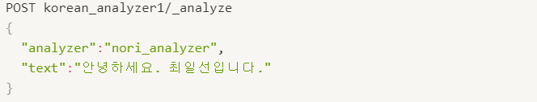

# 공공데이터를 ELK를 활용하여 시각화 프로젝트

## 1.	파이썬으로 엘라스틱서치 다루기

py index들을 출력

결과

___데이터 추가 및 서치에서 왜 에러?___

## 2.	한국어 형태소 분석기 노리 소개

한글 형태소 분석기로 한글을 분석하여 검색의 효율이 높아진다.

MeCab : 언어의 규칙 및 예외상황으로 언어의 형태를 분석

노리 토크나이저와 토큰 필터

nori_tokenizer : 토크나이저 -공백이나 문자 구두점을 사용하여 데이터를 나눈다.

nori_part_of speech : 토큰 필터

nori_readingform : 토큰필터

노리 토크나이저 -> 2가지 모드

decompound_mode - 3가지 모드

none 화합물 분해 없음

discard 화합물을 분해하고 원래의 형태를 버린다.

mixed 화합물을 분해하고 원래 형태를 유지한다.

user_dictionary
     
     mecab-ko-dic사전을 사용하여 사용자가 원하는 사전의 형식으로 만들 수 있다.

 analyzer 설정을 통해 원하는 설정을 커스터마이징하여 구성한다

analyzer를 직접 커스터마이징한 분석기로 설정을 하고 원하는 텍스트 데이터를 전송한다.

mixed 모드 때문에 원본을 유지하며 커스터마이징된 분석기에 맞는 데이터로 저장된다.

nori_part_of_speech

불필요한 태그는 삭제하는 설정을 할 수 있다.

NR = Numeral 숫자- 숫자에 해당하는 태그는 삭제한다.

이와 같은 데이터를 분석하면 일곱에 해당하는 필요 없는 태그는 삭제하여 사용
 
nori_readingform

한자를 한글로 고쳐준다.

필터를 nori_readingform을 통해 한자를 한글로 변환하는 분석기를 설정하고 한자의 데이터를 입력 시 자동으로 한글로 변환하여 데이터 분석하여 출력한다.

 
인덱스에 적용하여 실제로 검색이 가능하도록

먼저 매핑 작업이 필요하다.

PUT article로 인덱스를 설정하고 분석기를 설정한다.

매핑 정보도 미리 설정한다. 분석을 할 필드의 이름을 설정

데이터는 위와 같이 bulk를 통해 한 번에 원하는 데이터를 저장한다.

이와 같이 검색 쿼리에 .nori를 통해 형태소 분석하여 데이터를 검색이 가능하다.

## 청와대 국민청원 데이터 아카이브

데이터는 json의 형식으로 저장되어 있고 이를 활용하여 ELK를 활용하여 시각화

데이터를 수동 및 자동으로 업로드 기능이 존재한다.

파이선을 통해 json파일을 배치파일로 구성하여 자동으로 업로드가 가능하다. 

라이브러리 설치 : sudo apt install default-jdk git -y

파이썬으로 데이터 전처리

1번째 줄 : 데이터 다운로드

2번째 줄 : 디렉토리 이동

3번째 줄 : 확장자를 json으로 변경

os 라이브러리로 파일을 불러오기 위해 import

petitions로 시작하는 이름들의 경로를 출력 후 해당 파일의 데이터를 replace를 통해 데이터의 상하처리를 통해 해당 프레임에 맞게 설정한다. 

이후 bat 파일로 변환 후 쓰기 파일로 변환

이와 같이 파이선을 통해 데이터 전처리를 수행

이후 첫번째 사진의 4번째 줄로 모든 데이터 자동으로 전송

위의 화면과 같이 자동으로 많은 데이터를 한번에 올린다.

이후 키바나 인덱스 패턴 생성

최종 데이터 업로드 확인

nori 형태소 분석기를 활용하여 데이터 업로드 하기

분석기의 nori_tokenizer의 플러그인과 매핑 정보를 설정

실습 에러 ㅜ
