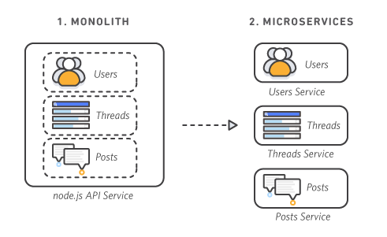
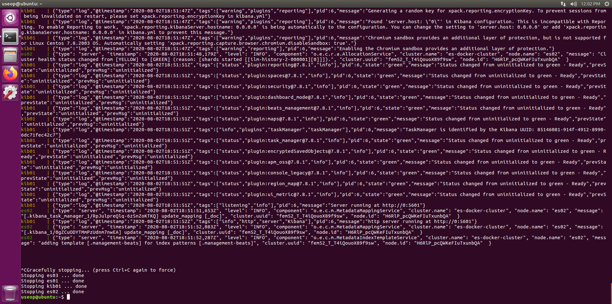
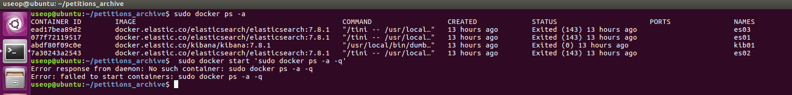

# 도커 컴포즈로 엘라스틱 클러스터 구현하기
## 1.	도커와 컨테이너 왜 필요한지 알고 계신가요!! 첫번째 이야기

도커 컨테이너가 편리하긴 한데 왜 쓰는걸까?

컨테이너가 왜 필요한지 : 개발팀과 운영팀의 차별화로 개발 시 대규모 프로젝트설계시 컨테이너의 활용으로 도움이 된다.

개발팀 : 새로운 언어나 효율적으로 활용할 수 있는 분야를 넓히려고 노력한다.

운영팀 : 안정적인 인프라를 유지하기 위해 안정적인 목표를 둔다.

버전이 다르거나 언어의 차이로 가상 환경을 통해 개발을 진행하지만 vmware와 같은 가상환경은 무겁다(하드웨어 및 O.S를 구현해야 하기 때문에 부하가 크다.) 

이 단점을 보완하기 위해 컨테이너를 사용하려는 추세이다.

VM : 운영체제와 하드웨어의 가상화로 무겁다.

도커 엔진 : 컨테이너를 통해 가상화 환경을 통해 효율적인 운영이 가능하다.

리눅스 컨트롤 그룹(Control Group)

리눅스 네임 스페이스 : 파일이나 네트워크의 가상화

->도커가 VM보다 안정적이고 성능이 훨씬 더 우수하다.
 

## 2.	도커와 컨테이너 왜 필요한지 알고 계신가요!! 두번째 이야기

MONOLITH : 서비스를 하나의 어플리케이션에 넣고 기능을 구현한다.
단점 : 한번 컴파일시 소요 시간 많고 정기적으로 단체로 조정이 필요하다.

MICROSERVICES : 개발팀이 개별적으로 개발 환경을 구축하고 분업화되어 각각의 서비스를 독립적으로 개발이 가능하다. 서비스가 한정된 자원에서 리소스 관리가 효율적이다.

성공 사례

아마존과 넷플릭스가 여러 컨테이너가 하나의 서비스를 제공한다.
 
## 3.	우분투 도커 컴포즈 설치와 환경 구성
sudo apt update

sudo apt install docker.io

sudo apt install docker-compose

도커로 elk를 구현

gedit docker-compose.yml을 통해 yml파일을 설정한다.

sudo ERSION=7.4.2 docker-compose up

___도커 문제 sudo docker start ‘sudo docker ps -a -q’ 명령어를 쳤는데 에러??___