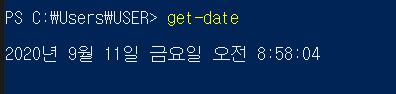
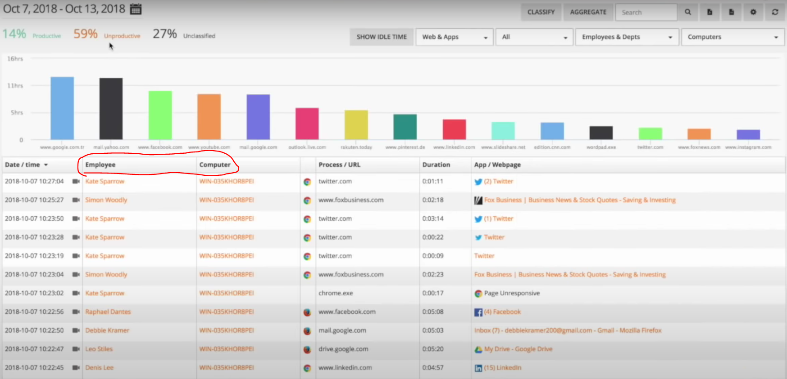
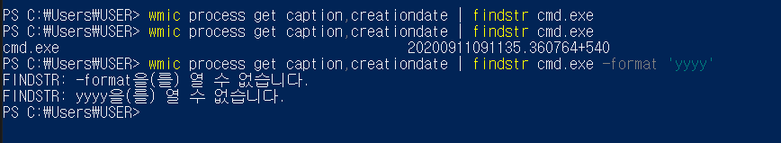

# 1주차 파이썬 기초 공부 이후 컴퓨터 시간 띄워 보기

파이썬 기초 공부는 유튜브 미운코딩새끼 파이썬 기초(https://www.youtube.com/playlist?list=PLGPF8gvWLYyrkF85itdBHaOLSVbtdzBww)에서 실습

이후 wikidocs의 점프 투 파이썬 을 통해 복습과 연습문제를 활용하여 파이썬 기초 실습 완료(https://wikidocs.net/4307)


# 시도해 본 것!
## 1. 컴퓨터 시간 띄우기


이 부분은 파이썬을 시작하고 이해가 잘 안되는 부분도 많았고 경진이가 미리 만들어둔 코드와 도움을 받아 실습을 진행

```
def computertime():
    time = subprocess.Popen(["powershell","get-date"], stdout=subprocess.PIPE).communicate()[0].decode("euc-kr")  
    return time
```
subprocess 코드 이해를 한 후 파워쉘에서 입력한 명령어를 받아오는 기능으로 이해하였고 파워쉘에서 get-date명령어 입력시 



파이썬 코드 실행 결과
```
print(computertime())
->
2020년 9월 11일 금요일 오전 9:47:22
```
___


## 2. 컴퓨터 명과 사용자 명 띄우기

우리가 최종적으로 만들 화면


이와 같이 해당 Username과 Computername을 사용하여 기록하기 때문에 이와 같은 컴퓨터 명과 사용자 명을 받아오는 함수를 만들어 보는 것도 좋을 것 같다고 생각하여 구글링을 통해 실습

```
import socket
import getpass

def User():
    user = {getpass.getuser(),socket.gethostname()}
    return user
```
파이썬 코드 실행 결과
```
print(User())
->
{'USER', 'DESKTOP-2J22J3Q'}
```
___

## 3. 원하는 프로세스 실행 시간 띄우기

이 다음도 이벤트 로그에 적절한 로그에 사용될 함수가 어떤 것이 있을까 찾아보며 가장 기본의 이벤트ID 1번인 Process create에 대해 필요한 함수를 생각하여 프로세스가 실행된 시간을 받는 함수를 만들도록 했다.

```
def processstarttime(process):
    cmd = "wmic process get caption,creationdate | findstr " + process
    time = subprocess.Popen(["powershell",cmd], stdout=subprocess.PIPE).communicate()[0].decode("euc-kr")
    result = time.split('                                           ')
    result[1] = '{}-{}-{} {}:{}:{}'.format(result[1][0:4],result[1][4:6],result[1][6:8],result[1][8:10],result[1][10:12],result[1][12:14])

    return result
```

원하는 동작은 측정하려는 프로세스를 인자로 입력하면 해당 프로세스명과 실행된 시간을 결과로 반환하는 함수이다.



해당 명령어를 파워쉘에 입력시 cmd.exe를 실행하지 않은 경우 아무런 결과 출력이 없지만 cmd를 실행 이후 명령어 입력시 프로세스명과 긴 공백 그리고 어떤 형식의 시작 시간이 출력

포멧팅을 통해 시간을 정렬할 생각이였으나 해당 함수에 지원안되는? 그래서 파이썬 코드로 적절하게 바꿔주는데 아직 어떤 함수가 존재하는지 잘 몰라 찾아보다 그냥 년 월 일 시 분 초에 맞는 위치를 직접 잘라 넣엇다.

파이썬 코드 실행 결과
```
print(processstarttime("cmd.exe"))
->
['cmd.exe', '2020-09-11 09:11:35']
```


___ 
### 실습 test.py 코드
```
import subprocess
import socket
import getpass

def computertime():


    time = subprocess.Popen(["powershell","get-date"], stdout=subprocess.PIPE).communicate()[0].decode("euc-kr")
   
    return time

print(computertime())

def User():
    user = {getpass.getuser(),socket.gethostname()}
    return user

print(User())

def processstarttime(process):
    cmd = "wmic process get caption,creationdate | findstr " + process
    time = subprocess.Popen(["powershell",cmd], stdout=subprocess.PIPE).communicate()[0].decode("euc-kr")
    result = time.split('                                           ')
    result[1] = '{}-{}-{} {}:{}:{}'.format(result[1][0:4],result[1][4:6],result[1][6:8],result[1][8:10],result[1][10:12],result[1][12:14])

    return result

print(processstarttime("cmd.exe"))
```