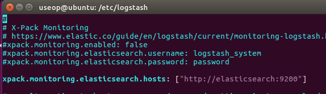
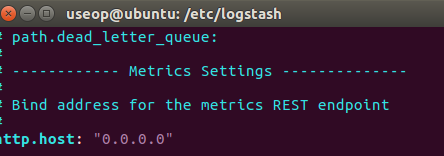
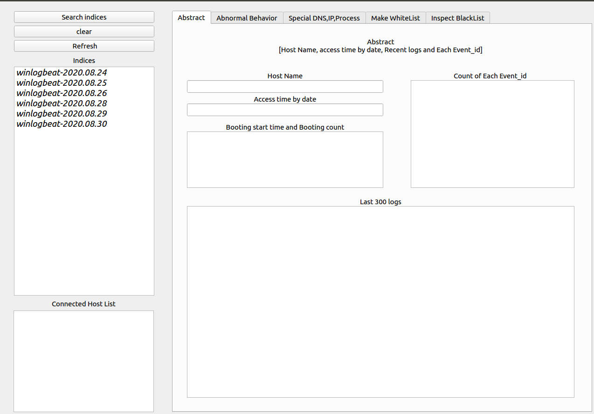
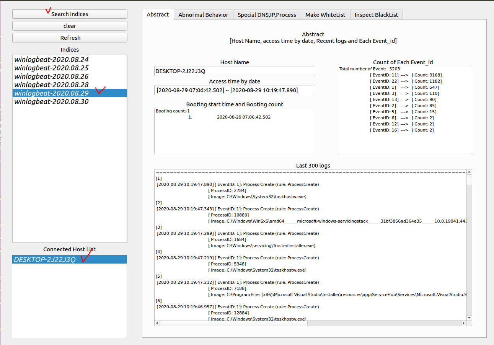
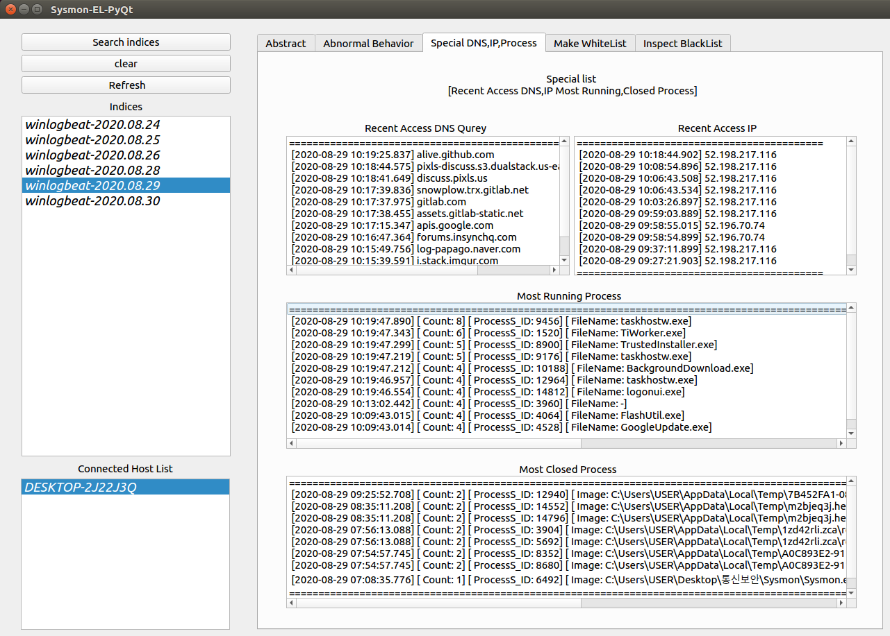
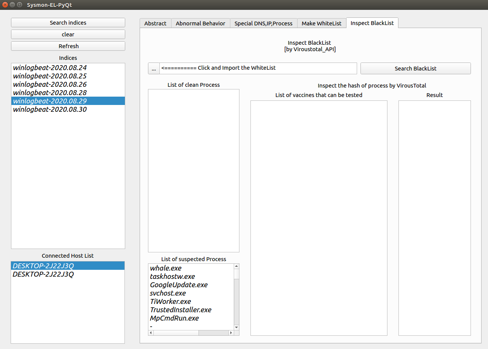

# Kwangwoon University Summer Short-Term Internship Results 실습해보기

__참고 사이트 https://github.com/whitejh/Sysmon-EL-Python_PyQt__

-----
## Host 설정
----
## sysmon 설정

sysmonconfig-export.xml로 환경 설정을 구성

```
PS> .\sysmon.exe -c sysmonconfig-export.xml
```
## Winlogbeat 설정

winlogbeat.yml 설정
```
winlogbeat.event_logs:
    - name: Microsoft-Windows-Sysmon/Operational

output.logstash:
    # The Logstash hosts
    hosts: ["Ubuntu_IP:5000"]
    index: winlogbeat
```
---
## Sever 설정
---
_이 부분 부터는 기존 우분투 환경이 아닌 처음부터 새로 환경을 구축하여 사용함_

도커 설치 : https://blog.cosmosfarm.com/archives/248/%EC%9A%B0%EB%B6%84%ED%88%AC-18-04-%EB%8F%84%EC%BB%A4-docker-%EC%84%A4%EC%B9%98-%EB%B0%A9%EB%B2%95/

도커 컴포즈 : https://soyoung-new-challenge.tistory.com/73

## Download Docker images

```
$ git clone https://github.com/deviantony/docker-elk.git
$ sudo docker-compose build
```


__이후 EL 설정__
해당 사이트 참고
https://judo0179.tistory.com/60 



## PyQt5 by Python 설치

https://somjang.tistory.com/entry/PythonUbuntu%EC%97%90-Python-37-%EC%84%A4%EC%B9%98%ED%95%98%EA%B8%B0

```
$ wget https://www.python.org/ftp/python/3.7.4/Python-3.7.4.tgz
$ tar xvfz Python-3.7.4.tgz 
$ cd Python-3.7.4  
$ ./configure 
$ make 
$ sudo make install 
$ python3 -V 
$ sudo apt-get install idle-python3.7
$ idle-python3.7 
```

## Run ELS QT

```
$ git clone https://github.com/leesk212/Sysmon-EL-Python_PyQt.git
$ cd Sysmon-EL-Python_PyQt/Code/
$ python3 main.py
```
해당 실습시 여러 문제가 끊임 없이 발생하였고

해당 문제들은 apt install들을 통해 해결을 해야 했다.

계속 뜨는 에러에 맞게 구글링을 통해 문제를 해결하였고 최종적으로 화면에 QT를 통한 결과가 출력이 되었다.









해당 프로그램을 실습을 진행하며 PyQt5에 대해 모르는 부분이 너무 많아 프로그램중 어떤 동작은 수행하지 못하는 부분도 있고 (아마 PyQt동작에 필요한 툴이 설치가 안되서 그런것 같다?) 정확히 어떤 동작을 수행하는지 모르겠다. 