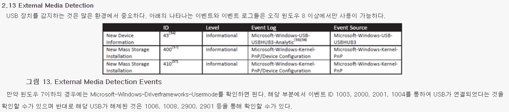
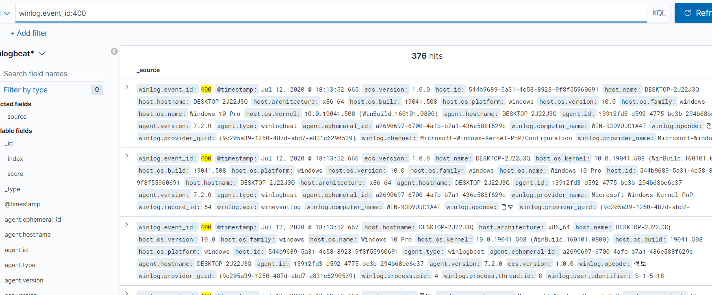
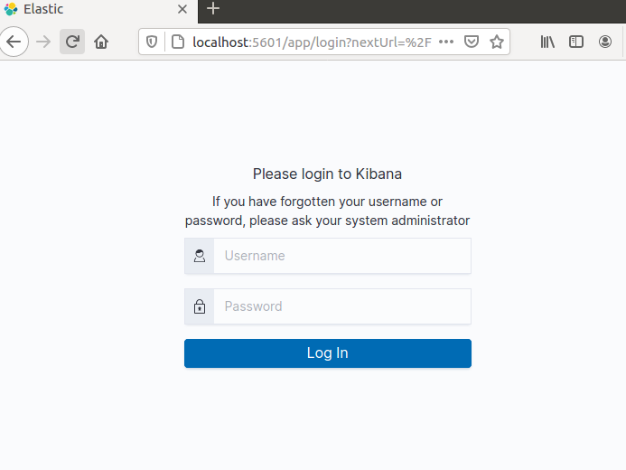
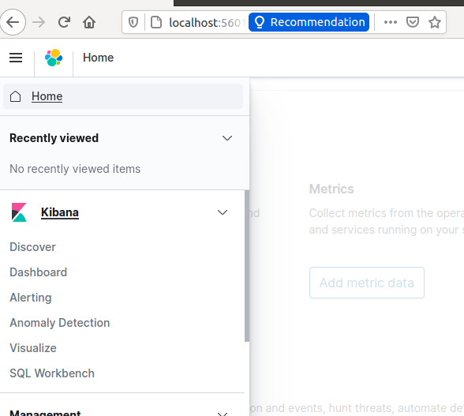
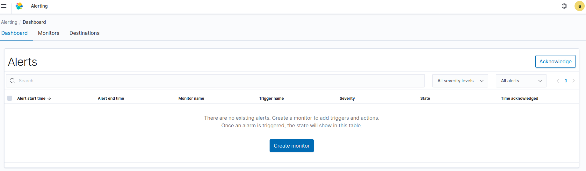
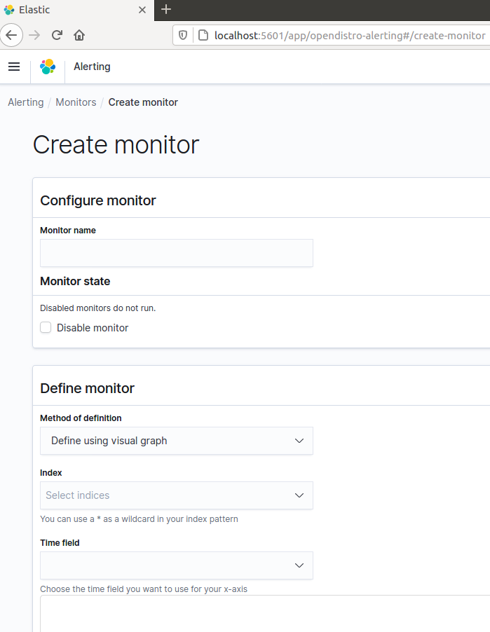

# 파일 유출에 대한 Alert 구현

## 1. USB 연결 관련 로그 출력
(https://kali-km.tistory.com/entry/Windows-Event-Log-2-%E2%80%93-%EC%A3%BC%EC%9A%94-%EC%9D%B4%EB%B2%A4%ED%8A%B8-%EB%A1%9C%EA%B7%B8?category=522239)


검색후 정보가 너무 많고 버전별로 상이해서 햇갈리는 부분이 조금 있었는데 여기서 400, 410 EVENT ID가 Microsoft-Windows-Kernel-PnP/Configuration 에서 USB 연결 로그 관리를 알 수 있다.

해당 로그 관련 출력을 위한 winlogbeat.yml 설정
```
winlogbeat.event_logs:
  - name: Microsoft-Windows-Kernel-PnP/Configuration
    event_id: 400, 410
    level: info
    provider: 
      - Microsoft-Windows-Kernel-PnP
```

이후 EC에 전송 결과


---
## 2. Alert 기능

Alert 기능은 xpack에서 기본적으로 elastic에서 제공하는 서비스가 있는데 유료 서비스(?)로 제공.

다양한 정보를 찾아보던 중 (https://woowabros.github.io/experience/2020/01/16/set-elk-with-alarm.html)해당 블로그에서 알람 기능을 사용하는 부분을 확인할 수 있었다.

해당 사이트에서 읽어보면 서비스 의도에 맞게 알람기능을 적절하게 사용할 수 있는 것 같다.

대충 내용이 우리와 동일하게 elk를 기본적으로 사용하고 데이터를 로그가 아닌 다른 데이터를 사용하고 해당 부분은 제외하고 opendistro 오픈소스를 설치하는 부분을 따라함.

걍 안됨. ㅅㅂ

https://opendistro.github.io/for-elasticsearch-docs/docs/install/docker/
open distro 공식 사이트 설치 방법 참고

도커를 활용하여 사용.

ㅈㄴ 안됨. 도커를 잘모르니 뭐가 문제가 되서 안되는 건지도 모르겟음.

도커 이미지를 받는데 뭘 하는 건지 모르겟네.

먼가 됨. 여러 환경을 구성하여 시도했는데 된 것 같다?
(https://www.youtube.com/watch?v=nuPQhhYJkFY)

처음에는 그냥 기존 elk 구동하는 도커의 설정 변경하여 환경 구성하는 것 같은데 도커 이미지를 통해 새로운 elk 환경을 구성해서 하니까 됨.

까먹지 않게 설치 방법 작성

1. 혹시 몰라 그냥 도커, 컴포즈를 모두 최신 버전으로 업데이트
2. ```docker pull amazon/opendistro-for-elasticsearch:1.10.1```와 ```docker pull amazon/opendistro-for-elasticsearch-kibana:1.10.1```로 도커 이미지 받아오기
3. 시키는대로 ```docker run -p 9200:9200 -p 9600:9600 -e "discovery.type=single-node" amazon/opendistro-for-elasticsearch:1.10.1``` 으로 도커 이미지 실행
4. ```curl -XGET https://localhost:9200 -u admin:admin --insecure```, 
```curl -XGET https://localhost:9200/_cat/nodes?v -u admin:admin --insecure```, ```curl -XGET https://localhost:9200/_cat/plugins?v -u admin:admin --insecure```로 서버 구동 환경 확인
5. ```docker ps```로 컨테이너 id 확인후 ```docker stop <container-id>```로 종료
6. 이후 ```docker-compose up```를 실행하면 오류가 나는데 docker-compose.yml파일이 없어서 오류가 난다.
7. 해당 사이트에 예시로 준 docker-compose.yml를 새로 생성하고 다시 ```docker-compose up```실행


localhost:5601로 키바나 접속하면 위와 같이 자동으로 security기능이 open distro에서 제공된 것 같다.

id: admin / password: admin으로 접속


이와 같이 kibana에서 alert가 추가되고 기본에서 추가적으로 제공되는 기능도 있는것(?) 같다.


들어가면 위와 같이 나타남. 먼가 처음보는 기능이라 적응이 안되지만 설렌다...


monitor설정으로 먼저 하고 alert 기능을 사용할 수 있는 것 같다.

USB관련 데이터를 해당 서버로 보내보며 확인해 봐야 겠다.

이후 눈치 챘지만 해당 도커 이미지로 elk를 구동하면 사실상 logstash가 없다?


먼가 도커로 맨날 elk 3개를 동시에 실행해서 당황스럽네

그럼 지금 상태로 도커로 elasticsearch와 kibana를 실행하고 logstash는 따로 서비스를 동작하여 dest만 잘 찍어주면 들어갈까?

찾아보니 아닌것 같다.

시도 1.
(https://medium.com/@sjoerdsmink/trying-out-open-distro-for-elasticsearch-with-logstash-8cc8be3e1e84)

먼저 로그스테시 도커 이미지 pull
```
sudo docker pull docker.elastic.co/logstash/logstash:7.9.2
7.9.2: Pulling from logstash/logstash
```
/usr/share/logstash에 logstash.conf 파일 생성후 적절하게 작성

docker-compose.yml을 적절하게 잘 사용


이후 ```sudo docker-compose up``` 입력하면 logstash 도커 이미지 적절하게 설치하는듯? 

진짜 한치앞도 모르는 것들을 진행해서 결과가 예상이 안감


들어갓다?


인덱스 설정을 어케한진 몰겟는데 알아서 security머시기로 들어갓네

근데 내가 보낸 데이터가 아닌데??


분명 여기선 내가 원하는 데이터 보낸게 맞는데 키바나에서 출력은 생각과 다른거 같은데 이부분은 다시 알아봐야 겠다.

시도2. security 문제(?)
opendistro에서 기본적으로 security 기능이 적용되어 실행이 되는데 logstash.conf 파일에 elasticsearch에 security로 접근이 안되는 것인가? 싶어 아래와 같이 변경
```
input {
  beats {
    port => 5044
  }
}

output {
  elasticsearch {
    hosts => ["http://localhost:9200"]
    index => "%{[@metadata][beat]}-%{[@metadata][version]}"
    user => "admin"
    password => "admin"
  }
}
```
아닌가? -> 맞는지 아닌지도 모른다. ㅅㅂ
버전에 지원안하는건지 ㅈㄴ 뭐때문인지 몰라서 더 짜증난다.

많이 찾아보고 해봣는데 잘 안된다. 정말.........

logstash -> elasticsearch로 로그전송에 문제가 생긴건데 elasticsearch에도 security기능이 있는건지 모르겟네 


# 진행 상황 설정
## winlogbeat.yml
```
###################### Winlogbeat Configuration Example ########################

# This file is an example configuration file highlighting only the most common
# options. The winlogbeat.reference.yml file from the same directory contains
# all the supported options with more comments. You can use it as a reference.
#
# You can find the full configuration reference here:
# https://www.elastic.co/guide/en/beats/winlogbeat/index.html

#======================= Winlogbeat specific options ===========================

# event_logs specifies a list of event logs to monitor as well as any
# accompanying options. The YAML data type of event_logs is a list of
# dictionaries.
#
# The supported keys are name (required), tags, fields, fields_under_root,
# forwarded, ignore_older, level, event_id, provider, and include_xml. Please
# visit the documentation for the complete details of each option.
# https://go.es.io/WinlogbeatConfig
winlogbeat.event_logs:
  - name: Microsoft-Windows-Kernel-PnP/Configuration
    event_id: 400, 410
    level: info
    provider: 
      - Microsoft-Windows-Kernel-PnP

# - name: Microsoft-Windows-Sysmon/Operational

   

#==================== Elasticsearch template settings ==========================

setup.template.settings:
 index.number_of_shards: 1
 #index.codec: best_compression
 #_source.enabled: false


#================================ General =====================================

# The name of the shipper that publishes the network data. It can be used to group
# all the transactions sent by a single shipper in the web interface.
#name:

# The tags of the shipper are included in their own field with each
# transaction published.
#tags: ["service-X", "web-tier"]

# Optional fields that you can specify to add additional information to the
# output.
#fields:
#  env: staging


#============================== Dashboards =====================================
# These settings control loading the sample dashboards to the Kibana index. Loading
# the dashboards is disabled by default and can be enabled either by setting the
# options here or by using the `setup` command.
#setup.dashboards.enabled: false

# The URL from where to download the dashboards archive. By default this URL
# has a value which is computed based on the Beat name and version. For released
# versions, this URL points to the dashboard archive on the artifacts.elastic.co
# website.
#setup.dashboards.url:

#============================== Kibana =====================================

# Starting with Beats version 6.0.0, the dashboards are loaded via the Kibana API.
# This requires a Kibana endpoint configuration.
#setup.kibana:

 # Kibana Host
 # Scheme and port can be left out and will be set to the default (http and 5601)
 # In case you specify and additional path, the scheme is required: http://localhost:5601/path
 # IPv6 addresses should always be defined as: https://[2001:db8::1]:5601
 host: "192.168.149.128:5601"

 # Kibana Space ID
 # ID of the Kibana Space into which the dashboards should be loaded. By default,
 # the Default Space will be used.
 #space.id:

#============================= Elastic Cloud ==================================

# These settings simplify using winlogbeat with the Elastic Cloud (https://cloud.elastic.co/).

# The cloud.id setting overwrites the `output.elasticsearch.hosts` and
# `setup.kibana.host` options.
# You can find the `cloud.id` in the Elastic Cloud web UI.
#cloud.id: "TEST:YXAtbm9ydGhlYXN0LTIuYXdzLmVsYXN0aWMtY2xvdWQuY29tOjkyNDMkYWU1Njg5Yzk2Y2FlNDFmZjhmYWQzYzg2ZjdhZWMzMTYkYmUzYzJjNDBmY2FjNGE1ZWI3MGU0NWY5NDY5ZDczYWE="

# The cloud.auth setting overwrites the `output.elasticsearch.username` and
# `output.elasticsearch.password` settings. The format is `<user>:<pass>`.
#cloud.auth: "elastic:VkWaF1WtGEDc89qXD5rtla1b"

#================================ Outputs =====================================

# Configure what output to use when sending the data collected by the beat.

#-------------------------- Elasticsearch output ------------------------------
#output.elasticsearch:
 # Array of hosts to connect to.
 #hosts: ["localhost:9200"]

 # Optional protocol and basic auth credentials.
 #protocol: "https"
 #username: "elastic"
 #password: "changeme"

#----------------------------- Logstash output --------------------------------
output.logstash:
 # The Logstash hosts
 hosts: ["192.168.149.128:5044"]


 # Optional SSL. By default is off.
 # List of root certificates for HTTPS server verifications
 #ssl.certificate_authorities: ["/etc/pki/root/ca.pem"]

 # Certificate for SSL client authentication
 #ssl.certificate: "/etc/pki/client/cert.pem"

 # Client Certificate Key
 #ssl.key: "/etc/pki/client/cert.key"

#================================ Processors =====================================

# Configure processors to enhance or manipulate events generated by the beat.

processors:
 - add_host_metadata: ~
 - add_cloud_metadata: ~

#================================ Logging =====================================

# Sets log level. The default log level is info.
# Available log levels are: error, warning, info, debug
#logging.level: debug

# At debug level, you can selectively enable logging only for some components.
# To enable all selectors use ["*"]. Examples of other selectors are "beat",
# "publish", "service".
#logging.selectors: ["*"]

#============================== Xpack Monitoring ===============================
# winlogbeat can export internal metrics to a central Elasticsearch monitoring
# cluster.  This requires xpack monitoring to be enabled in Elasticsearch.  The
# reporting is disabled by default.

# Set to true to enable the monitoring reporter.
#monitoring.enabled: false

# Uncomment to send the metrics to Elasticsearch. Most settings from the
# Elasticsearch output are accepted here as well.
# Note that the settings should point to your Elasticsearch *monitoring* cluster.
# Any setting that is not set is automatically inherited from the Elasticsearch
# output configuration, so if you have the Elasticsearch output configured such
# that it is pointing to your Elasticsearch monitoring cluster, you can simply
# uncomment the following line.
#monitoring.elasticsearch:

#================================= Migration ==================================

# This allows to enable 6.7 migration aliases
#migration.6_to_7.enabled: true
```

## docker-compose.conf
```
version: '3' 
services: 
  odfe-node1: 
    image: amazon/opendistro-for-elasticsearch:1.10.1 
    container_name: odfe-node1 
    environment: 
      - cluster.name=odfe-cluster 
      - node.name=odfe-node1 
      - discovery.seed_hosts=odfe-node1,odfe-node2 
      - cluster.initial_master_nodes=odfe-node1,odfe-node2 
      - bootstrap.memory_lock=true # along with the memlock settings below, disables swapping 
      - "ES_JAVA_OPTS=-Xms512m -Xmx512m" # minimum and maximum Java heap size, recommend setting both to 50% of system RAM 
    ulimits: 
      memlock: 
        soft: -1 
        hard: -1 
      nofile: 
        soft: 65536 # maximum number of open files for the Elasticsearch user, set to at least 65536 on modern systems 
        hard: 65536 
    volumes: 
      - odfe-data1:/usr/share/elasticsearch/data 
    ports: 
      - 9200:9200 
      - 9600:9600 # required for Performance Analyzer 
    networks: 
      - odfe-net
  odfe-node2:
    image: amazon/opendistro-for-elasticsearch:1.10.1
    container_name: odfe-node2
    environment:
      - cluster.name=odfe-cluster
      - node.name=odfe-node2
      - discovery.seed_hosts=odfe-node1,odfe-node2
      - cluster.initial_master_nodes=odfe-node1,odfe-node2
      - bootstrap.memory_lock=true
      - "ES_JAVA_OPTS=-Xms512m -Xmx512m"
    ulimits:
      memlock:
        soft: -1
        hard: -1
      nofile:
        soft: 65536
        hard: 65536
    volumes:
      - odfe-data2:/usr/share/elasticsearch/data
    networks:
      - odfe-net
  kibana:
    image: amazon/opendistro-for-elasticsearch-kibana:1.10.1
    container_name: odfe-kibana
    ports:
      - 5601:5601
    expose:
 - "5601" 
    environment: 
      ELASTICSEARCH_URL: https://odfe-node1:9200 
      ELASTICSEARCH_HOSTS: https://odfe-node1:9200 
    networks: 
      - odfe-net 
  logstash: 
    image: docker.elastic.co/logstash/logstash-oss:7.9.2 
    container_name: logstash 
    volumes: 
    - ./logstash.conf:/usr/share/logstash/logstash.conf 
    ports: 
      - "5044:5044" 
    networks: 
      - odfe-net 
    depends_on: 
      - odfe-node1 
 
volumes: 
  odfe-data1: 
  odfe-data2: 
 
networks: 
  odfe-net: 
```
## logstash.yml
```
input {
  beats {
    port => 5044
  }
}

output {
  elasticsearch {
    hosts => ["http://localhost:9200"]
    index => "%{[@metadata][beat]}-%{[@metadata][version]}"
  }
}
```