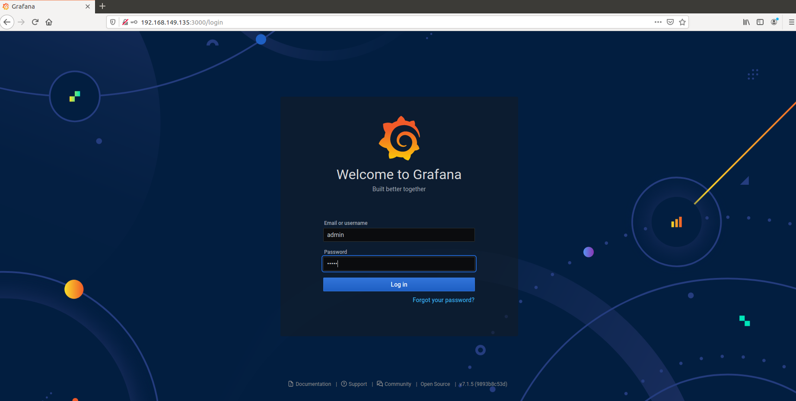
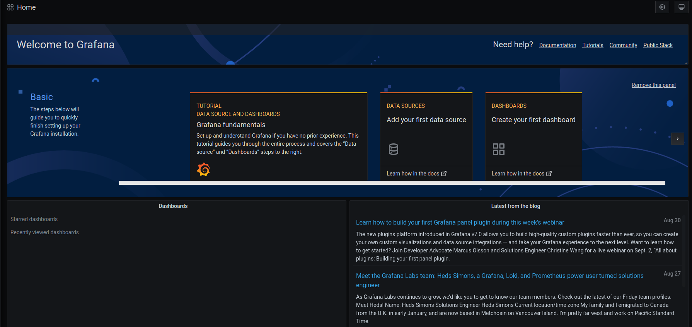
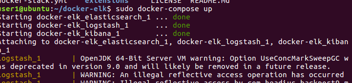
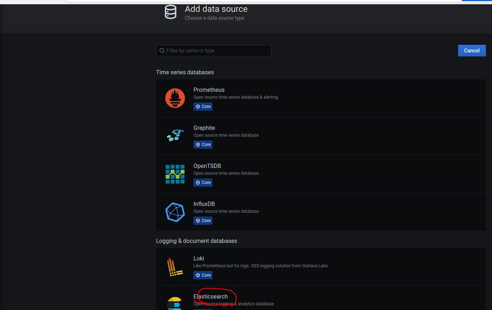
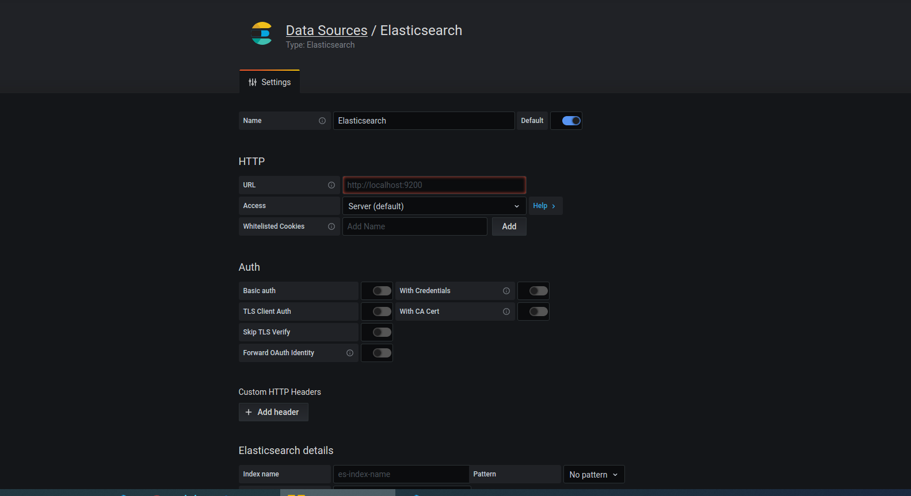
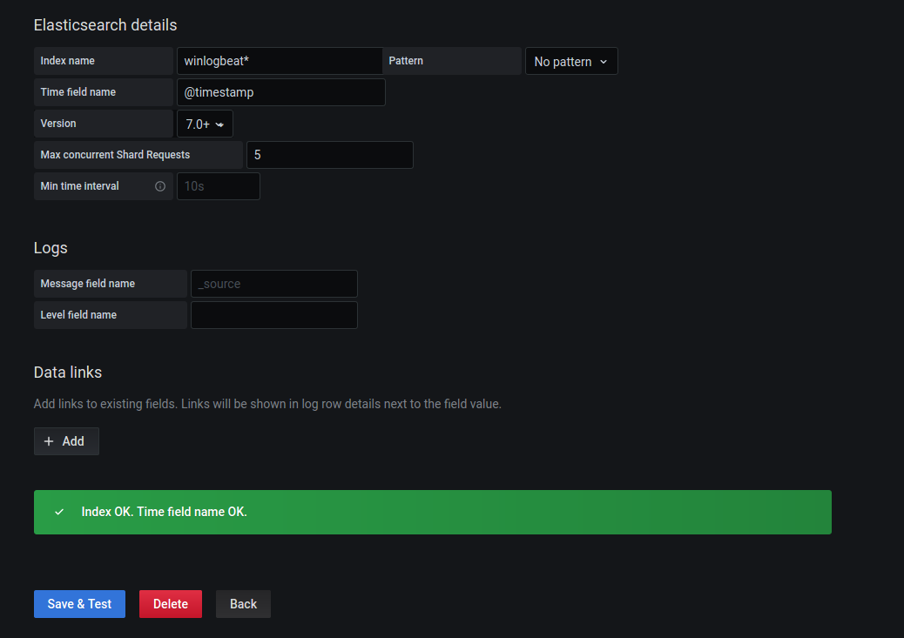
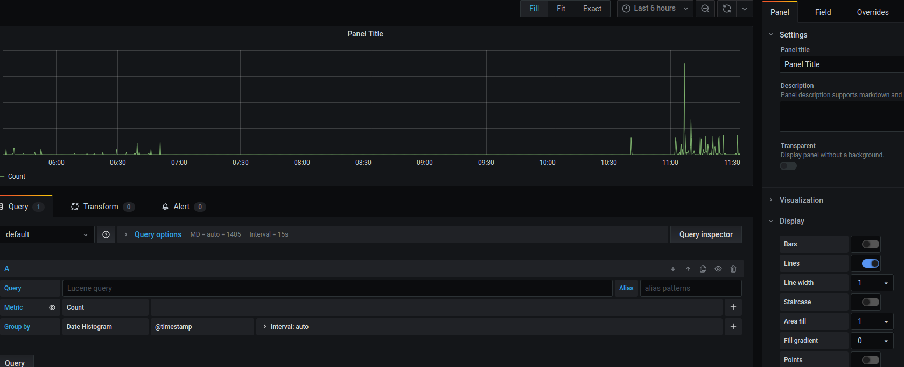
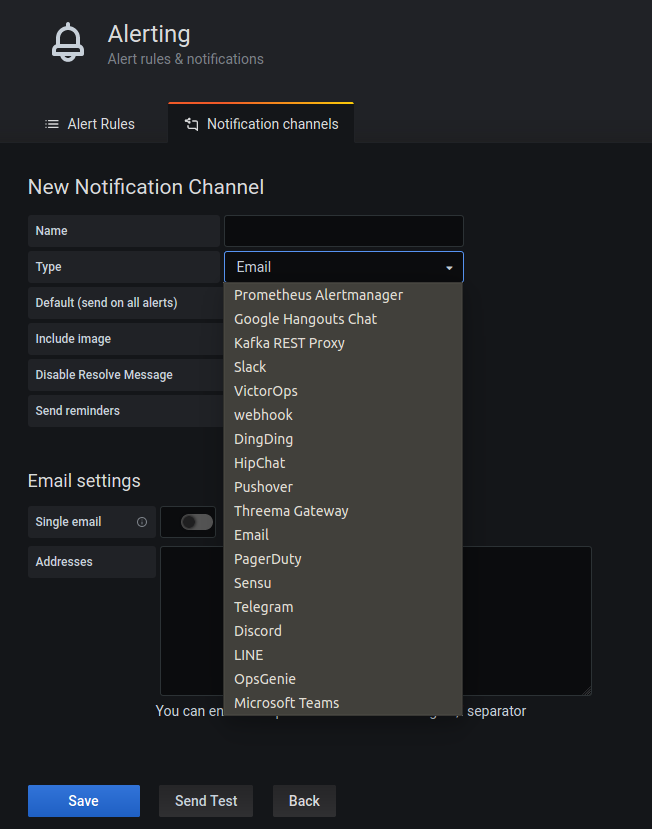

# Grafana를 활용하여 로그 데이터 시각화
키바나가 아닌 다른 대쉬보드를 활용하여 시각화를 시도

키바나에서 제공하지 못하는 기능을 제공할 수 있고 우리의 프로젝트에 사용될 수 있는 대시보드 환경을 줄 수 있을 수도 있다.

먼저 무작정 실습을 통해 배워 보겠음
___
## Grafana 설치

```
# The command add-apt-repository isn’t a default app on Debian 9 and requires
$ apt-get install -y software-properties-common

# Install the repository for stable releases
$ sudo add-apt-repository "deb https://packages.grafana.com/oss/deb stable main"

$ wget -q -O - https://packages.grafana.com/gpg.key | sudo apt-key add -

$ sudo apt-get update
$ sudo apt-get install grafana

$ sudo apt-get install -y apt-transport-https

$ sudo service grafana-server start
```

참고 사이트 (https://has3ong.tistory.com/626)

이후 localhost:3000으로 접속



ID/PW : admin/admin

접속 후 화면



이후 Grafana의 실습 내용은 (https://www.youtube.com/watch?v=qI7_By77c6c) 영상을 따라 실습을 진행함.

___
## Elasticsearch의 데이터 소스를 grafana에 추가



ELK service start

elasticsearch의 로그데이터를 사용하여 grafana에 시각화 하는 것이기 때문에 kibana는 안켜도 상관은 없을 듯? 하다.



Add data source를 통해 로그 데이터를 elasticsearch와 연동을 시키도록 한다.


위와 같이 Elasticsearch와 인덱스 연동 및 설정

위의 내용에 Whitelisted Cookies와 같은 내용은 실습 내용에 없지만 나중에 해당 내용을 살펴보며 유용한 기능을 찾아 볼 수 있도록 하면 좋을 것 같다.

영상 실습중 문제가 있는데 localhost:9200을 HTTP URL로 설정이 되어있는데 본 Elasticsearch의 URL로 변경해서 올려준다.

나같은 경우에는 127.0.0.1:9200으로 변경하니 인덱스 설정이 성공



___
## Visualize data



위와 같이 대시보드가 디폴트로 설정이 되어 있고 이후 진행은 영상을 따라 실습이 불가능 하다. 

이유는 영상 로그들이 필요한 것에 따라 필터링 및 인덱싱이 되어 사용이 되어 있는 것 같다. 

___
## Kibana vs grafana

Grafana는 다양한 데이터 베이스를 골라서 시각화가 가능하다(이 기능은 어차피 우리가 elasticsearch만 사용한다면 좋은 장점은 아닌듯)

키바나와 다르게 grafana는 alerting기능이 존재하는데 키바나는 xpack인 유료 플랜이지만 grafana는 무료기능으로 Discord, Email, Slack과 같이 다양한 채널로 알림을 받을 수 있다.


위의 화면과 같이 알림 기능을 통해 우리 프로젝트에서는 예를 들어 Blacklist 접속이나 업무 몰입도 기준 이하일 경우 알림을 받을 수 있도록 할 수 있을 것 같다.

하지만 우리가 원하는 복잡한 기능의 대쉬보드 출력은 안되는 것(?) 같다.
