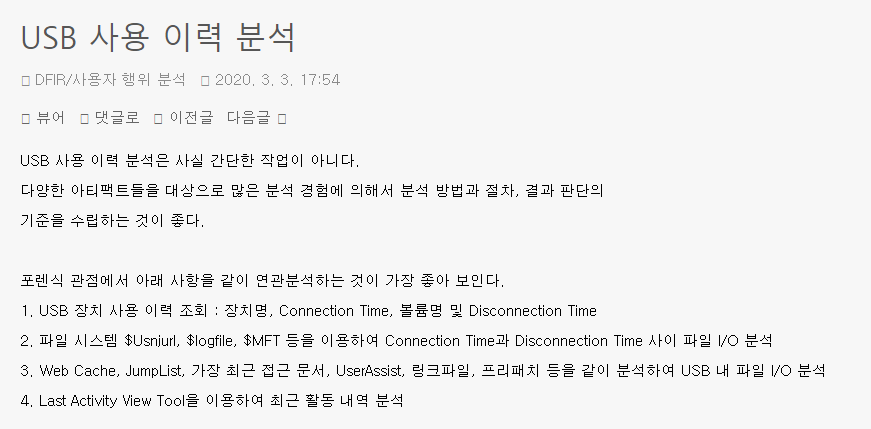
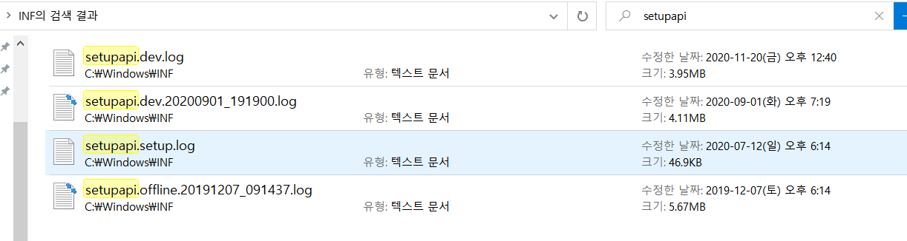
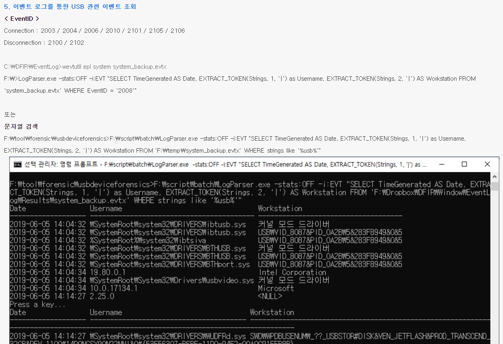

# USB 연결 관련 로그 조사

(참고 : http://forensic-proof.com/archives/5945)

USB와 같은 장치를 연결하면 윈도우는 장치로부터 드라이버를 받아 설치하거나 이미 있다면 기존 드라이버를 로드시키고, 연결 해제 시 드라이버를 언로드 시킨다. 이와 같은 드라이버 이벤트는 다음 로그 파일에 기록된다.

장치 연결 시 드라이버 로드는 반드시 일어나므로 해당 이벤트 로그를 확인하면 장치의 연결, 해제 흔적을 알 수 있다.

이벤트 뷰어 Microsoft-Windows-DriverFrameworks-UserMode에서 확인해 보자


해당 자료와 동일하게 2000번대 event id로 드라이버 이벤트들이 출력된다.

이게 우리가 원하는 로그인가?

관련 로그가 시작되면 짧은 순간 비슷한 event들이 8개씩 발생한다.

1.장치 ROOT\SYSTEM\0001에 대한 Pnp 또는 Power 작업(22, 2)을 받았습니다.

2.장치 ROOT\SYSTEM\0001에 대한 Pnp 또는 Power 작업(22, 2)을 상태가 0xC00000BB인 아래쪽 드라이버로 전달했습니다.

3.장치 ROOT\SYSTEM\0001에 대한 Pnp 또는 Power 작업(22, 2)을 받았으며 이 작업은 상태가 0x0인 아래쪽 드라이버에서 완료되었습니다.

4.상태가 0x0인 장치 ROOT\SYSTEM\0001에 대한 Pnp 또는 Power 작업(22, 2)을 완료했습니다.

5.장치 ROOT\SYSTEM\0001에 대한 Pnp 또는 Power 작업(22, 2)을 받았습니다.

6.장치 ROOT\SYSTEM\0001에 대한 Pnp 또는 Power 작업(22, 2)을 상태가 0xC00000BB인 아래쪽 드라이버로 전달했습니다.

7.장치 ROOT\SYSTEM\0001에 대한 Pnp 또는 Power 작업(22, 2)을 받았으며 이 작업은 상태가 0x0인 아래쪽 드라이버에서 완료되었습니다.

8.상태가 0x0인 장치 ROOT\SYSTEM\0001에 대한 Pnp 또는 Power 작업(22, 2)을 완료했습니다.

이런 로그들이 8개씩 작성되는데 해당 자료에서는 

'각 이벤트 설명에는 제조사,제품명,시리얼번호가 포함된 장치식별자가 포함되어 연결한 장치의 상세 정보를 알 수 있다.'

라고 작성되어 있는데 


상세한 정보가 뭔지 모르겠네 진짜 상세한건가? 로그 기록에 대해 잘몰라서 그런건지 나한테는 부족한 정보인것 같다. 예상컨데 14년도 자료라 window 버전에 따라 이벤트 기록 정보가 다른것 같기도 하다.

해당 자료의 별첨에 작성된 자료 (http://www.swiftforensics.com/2013/11/event-log-entries-for-devices-in.html)에서는 window8 관련 자료라 되어있는것 보니 버전에 따라 다른것 같네

참고 자료에서 작성된 로그 확인


DriverFrameworks-UserMode에서는 10000 event id가 내 로그에는 없었다.
 제일 높은 id가 2901번

 
 

 장치가 처음 연결되거나 다른 포트에 연결이 된 경우

 이건 테스트 결과 신기하게 사용하던 마우스를 다른 포트에 연결시 이벤트 뷰어에서 새로운 이벤트를 확인할 수 있다고 뜨면서 아래와 같은 로그가 출력

 

 먼가 usb를 기존에 사용하던 포트 말고 다른 포트에 연결시 새로운 로그가 생성되는 것 같은데 로그 정보가 유용한 자료인지 모르겠다.


이 로그는 저번 usb관련 로그에서 사용한 로그정보인데 장치를 처음 연결한 경우에만 로그가 기록이 되는 것이구나~


이 로그는 매번 장치가 연결된 경우 로그 기록이 되는 것으로 작성 되어있다. 유용한 로그일 것 같고 자세한 정보가 기록되어 있으면 좋을 것 같다.

근데 찾아보니 없네? 버전 차이?


(https://df-stream.com/tag/event-logs/)
또 다른 참고 사이트 확인한 결과 Connection Event IDs The records include those with Event ID 2003, 2004, 2005, 2010, 2100, 2105, and more.

하지만 The Windows 7 Event Log and USB Device Tracking 

window 7에만 해당되는 것인지 최신 자료를 찾아봐야 할 것 같다.

---

# 최근 정리된 사이트

https://secuworld.tistory.com/category/DFIR/%EC%82%AC%EC%9A%A9%EC%9E%90%20%ED%96%89%EC%9C%84%20%EB%B6%84%EC%84%9D


도움이 될 것 같다.



해당 게시물에서 USB 연결 관련 분석으로는 5가지를 제시한다.

1. 이벤트 로그 분석

2. 운영제체 로그 파일

3. 레지스트리

4. USBDevView Tool

5. USB Forensic Tracker Tool

우리 프로젝트에서 사용하는 내용은 window event 로그를 활용하여 사용하기 때문에 1번으로 분석하는 방법 뿐이다.

2번의 운영체제 로그 파일은 본문 내용 확인 결과 

아래 파일을 통해 USB 연결사실과 최초 연결 시각을 확인 할 수 있다.

Windows 2000/XP : %SystemRoot%\Setupapi.log

Windows Vista/7/8 : %SystemRoot%\inf\Setupapi.dev.log

 

* C:\Windows\INF\setupapi.dev.log 
* C:\Windows\INF\ setupapi.dev.yyyymmdd_hhmmss.log 
* C:\Windows\INF\setupapi.upgrade.log 
* C:\Windows\setupapi.log 

이와 같이 작성이 되어 있는데 내 컴퓨터에서 해당 자료를 찾아보면



```
>>>  [Device Install (DiShowUpdateDevice) - USB\VID_174F&PID_118D&MI_00\7&37167FC0&0&0000]
>>>  Section start 2020/09/02 13:40:16.070
      cmd: "C:\Windows\system32\mmc.exe" C:\Windows\system32\devmgmt.msc
     dvi: {DIF_UPDATEDRIVER_UI} 13:40:16.070
     dvi:      Default installer: Enter 13:40:16.085
     dvi:      Default installer: Exit
     dvi: {DIF_UPDATEDRIVER_UI - exit(0xe000020e)} 13:40:16.085
     ndv: {Update Driver Software Wizard - USB\VID_174F&PID_118D&MI_00\7&37167FC0&0&0000}
!    ndv:      Searching Windows Update has been disabled for the Update Wizard.
!    ndv:      Policy has been set to prevent searching Windows Update for drivers.
     ndv:      Search options: 0x00000003
     ndv:      Searching currently installed INF
     dvi:      {Build Driver List} 13:40:17.226
     dvi:           Searching for hardware ID(s):
     dvi:                usb\vid_174f&pid_118d&rev_0008&mi_00
     dvi:                usb\vid_174f&pid_118d&mi_00
     dvi:           Searching for compatible ID(s):
     dvi:                usb\class_0e&subclass_03&prot_00
     dvi:                usb\class_0e&subclass_03
     dvi:                usb\class_0e
     dvi:           Created Driver Node:
```

이와 같이 .log파일로 저장이 되어 있고 window event 파일과 다른 것같은데 활용할 수 있을지 모르겠다.

---


따라서 우리 프로젝트에서 사용할 수 있는 내용인 이벤트 로그 분석 내용에 대해 알아봐야 한다.

1) Microsoft-Windows-Storage-ClassPnP%4Operational.evtx 분석

C:\WINDOWS\System32\winevt\logs\Microsoft-Windows-Storage-ClassPnP%4Operational.evtx"이 로그는 아래와 같다.


해당 이벤트 로그를 이벤트 뷰어에서 확인하면 아래와 같다 심란하네...

다 오류로만 저장되어있는 로그 뿐이네


2) Microsoft-Windows-DriverFrameworks-UserMode/Operational 분석

USB 장탈착 이력, 윈도우 8+ 에서는 파일이 존재하지 않는다.

라고 작성이 되어 있다. 근데 이 로그가 이전에 찾아봤던 내용중에 있던 내용과 동일하다.


이전에 설명한 8개씩 짝지어서 로그 정보 기록되는 정보인데 어떻게 사용해야할지 모르겠다. 보안 및 포렌식 전문 블로그에서 작성되어 있는것 보면 중요한 자료인것 같은데 활용범위를 모르겠다.


3) System Event Log 분석

```
f:\temp>wevtutil epl system system-export.evtx
```
이와 같이 작성되어 있는데 해당 내용은 webtutil이라는 툴을 활용하여 로그 분석하는 것 같다. 그럼 winlogbeat에 담을 수가 없자나...

4) 기타 Event Log 분석

```
* C:\Windows\System32\winevt\Logs\Microsoft-Windows-DriverFrameworks-UserMode%4Operational.evtx (Windows 7)
* C:\Windows\System32\winevt\Logs\Microsoft-Windows-Storage-ClassPnP/Operational.evtx  (Window 10)
* C:\Windows\System32\winevt\Logs\Microsoft-Windows-WPD-MTPClassDriver/Operational.evtx
```
위에 2개는 위에서 이미 다룬 로그 내용이고 가장 아래에 관한 로그는 찾아보면 아래와 같다.


찾아보면 알겠지만 해당 로그를 어떻게 해야할지 모르겠다. 뭔 애플 아이패드가 뜨는데 연결한적이 있는거 같기도 한데...


---
## 해당 자료에서 USB분석 예제 내용

1. USB VID & PID 조회

해당 내용은 레지스트리 분석 내용인데 우리 프로젝트에 적용 가능한지?


2. Serial Number 조회

1번과 동일 문제

3. Drive Letter 조회


4. USB 연결 시간
5. 이벤트 로그를 통한 USB 관련 이벤트 조회



여기서 도움 되는 내용은 
```
Connection : 2003 / 2004 / 2006 / 2010 / 2101 / 2105 / 2106 
Disconnection : 2100 / 2102
```
뿐인것 같다.


이 로그만을 통해 분석을 해야할 것 같다.


이와 같이 winlogbeat yml파일을 설정하면 위의 로그를 출력할 수 있다.


