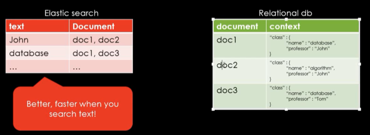
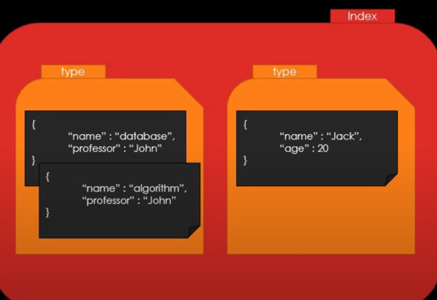
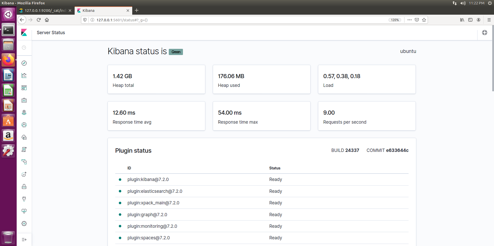

# 1주차
## 1. sysmon과 winlogbeat이해

__https://www.youtube.com/watch?v=4x054MeYS14 (ELK설치 + Sysmon연동) - 월요일__

ELK + Sysmon -> 장점 기존 sysmon의 이벤트 분석보다 시각화가 좋고 분석이 수월하다. 실시간 로그 전송 가능

1. sysmon에서 로그 데이터 수집
2. winlogbeat로 로그 데이터 전송
3. Ubuntu로 DB에 저장 ( LogStash )		2,3,4가 ELK
4. Kibana로 분석

logstash에서 로그 데이터를 수신 및 가공

logstash 설정 : elasticsearch에 보낼 로그 설정

sysmon의 로그를 바로 elasticsearch로 전송

input : beats라는 것을 통해 받는다.

output : elasticsearch로 보낼 계정 패스워드, elasticsearch에서 검색할때 고유한 값 = index ( 날짜로 설정 ), 도큐먼트 타입 설정

각 도커 컨테이너의 포트는 docker-compose.yml파일 에 저장되어 있다.

winlogbeat 설정법 : window powershell(관리자권한)에 해당 winlogbeat의 폴더 경로로 이동 -> winlogbeat의 폴더에 yml파일의 내용을 변경 ==>> sysmon의 이벤트 log를 수집하여 logstash로 보낸다(우분투 ip)

sysmon 설정법 : 어떤 로그를 수집할지 기업에서 미리 설정한 내용을 sysmon폴더에 저장후 cmd의 관리자권한으로 sysmon의 폴더로 이동 -> .\sysmon.exe -i [sysmon설정파일.xml] 이후 sysmon started가 떠야 함

이후 powershell에서 winglobeat 실행 

PS> .\install-service-winlogbeat.ps1 (여기서 권한이 없는경우 2. Get-ExecutionPolicy 명령어를 작성하면 본인의 권한? 상태가 보여집니다. 3. 권한이 RemoteSigned 가 아니라면 Set-ExecutionPolicy RemoteSigned 를 입력

PS> start-service winlogbeat     < - > stop-service winlogbeat(서비스 중단)

이후 get-service winlogbeat로 서비스가 running으로 변경되며 서비스가 실행한다.

여기까지 현재 상황

sysmon의 데이터가 logstash로 실시간으로 전송중이고 elastic search에 실시간으로 저장이된다.

이후 우분투의 서버에서 나의 ip에 kibana의 port numb으로 인터넷 접속 (http://192.168.0.64:5601/) 이후 kibana설정의 Index Patterns에서 Create index pettern에서 winlogbeat-2020.날짜가 index로 설정된 날짜가 설정이 된다.

이후 index pattern을 winlogbeat이후 next step 다음 x축은 timestamp로 index pattern을 만들면 실시간으로 전송된 sysmon이 elk로 전송이 되고 kibana에서 데이터를 확인할수 있다. 이후 kinana의 discover에서 log를 확인할 수 있다.

위에서 쿼리를 통해 로그 분석할 수 있다.

winlog.event_id등 키워드를 통해 검색 및 분석이 가능하다.
 
## 2. sysmon view를 이용해 이벤트로그 제대로 알기

__https://www.youtube.com/watch?v=kHir2ZqGMaw (효율적분석) - 화__

수많은 Sysmon log들을 Sysmon tool의 sysmonView를 통해 실습

이벤트 뷰어에 저장된 Sysmon log를 xml파일로 로그 저장

이후 sysmonView에서 import Sysmon xml event로 로그 파일 불러오기
프로세스 명으로 정보들이 출력된다.

의심이 가는 프로세스를 선택하여 source 및 destination ip를 확인하여 의심되는 ip를 확인할 수 있다. 

정형화된 포트번호 (4444)와 같은 포트는 의심이 된다. 원하는 프로세스를 선택하여 의심되는 부분을 추적하여 활용할 수 있다.

외부 침입은 window에서 cmd를 통해 동작하기 때문에 cmd를 의심
 
## 3. 무료 인프런 강좌

__https://www.inflearn.com/course/elk-%EC%8A%A4%ED%83%9D-%EB%8D%B0%EC%9D%B4%ED%84%B0-%EB%B6%84%EC%84%9D#curriculum__

1. 데이터 과학은 각 영역별 전문가끼리 팀워크로 개발한다.

* 빅데이터를 다루기 위한 ELK STACK (elasticsearch , logstash, kibana)를 활용

* logstash로 로그들을 elasticsearch로 보내고 해당 로그들의 분석을 kibana로 시각화 하여 출력

2. 16.04우분투로 사용 가능 
jdk설치 후 elastic search 설치
elasticsearch start : sudo service elasticsearch start
elasticsearch stop : sudo service elasticsearch stop
서버 확인 : curl -XGET ‘localhost:9200’ # check if elasticsearch run

3. elasticsearch에서는 키워드만을 통해 해당document에 저장한다. 이를 통해 더 빠르고 찾기가 수월하다.

이와 같이 관계형 데이터베이스와 같이 활용된다.

4. GET = Read, PUT = Update , POST = Create, DELETE = delete
elasticsearch에 index가 존재하는지 검색 : curl -XGET http://localhost:9200/classes?pretty

status : 404 index가 존재하지 않는다.

index 생성 : curl -XPUT http://localhost:9200/classes

index 제거 : curl -XDELETE http://localhost:9200/classes

type error시 -H’Content-Tyle: application/json’ 추가

document 생성 : curl -XPOST http://localhost:9200/classes/class/1/ -d ‘{“title” : “Algorithm”, “professor” : “john”}’

파일을 사용하여 document 생성 : curl -XPOST http://localhost:9200/classes/class/1/ -d @oneclass.json

5. Update

한 개의 필드 추가 : curl -XPOST http://localhost:9200/classes/class/1/_update?pretty -d ‘{“doc” : {“unit” : 1} }’

script를 사용하여 필드 내용 변경 : curl -XPOST http://localhost:9200/~/_update -d ‘ {“script” : “ctx._source.unit += 5”}’
6. 여러 개의 도큐먼트를 한번에 XPOST

curl -XPOST 주소 _bulk?pretty --data-binary @classes.json
7. 맵핑

숫자인데 문자열로 저장되거나 이러한 오류가 발생할 수 있으므로 데이터를 관리할 때 매핑을 추가하여 사용하는게 좋고 분석 및 시각화에 도움을 준다.

매핑 명령어 : curl -XPUT ‘http://localhost:9200/classes/class/_mapping’ -d @매핑 파일

8.elasticsearch의 search function

search 명령어 : curl -XGET localhost:9200/basketball/record/_search?pretty

search 옵션중 url 옵션을 통해 _search?q=points:30&pretty로 point가 30인것만 출력할 수 있다

Request body를 사용 : curl -XGET ‘로컬주소 _search -d ‘ {옵션}

request body는 여러가지 옵션이 있으므로 원하는 옵션은 elastic에서 검색 후 활용

8. 어그리게이션

elasticsearch의 도큐먼트에 조합을 통해 값을 도출하는 것

Metirc aggregation : 평균, 최고값 등 산술연산

명령어 : curl -XGET localhost:9200/_search?pretty –data-binary @옵션_points_aggs.json

avg, max, min, sum의 옵션이 가능하고 이 옵션들을 한번에 확인하는 옵션 : stats

9.  버켓 어그리게이션 : group by와 같이 도큐먼트를 팀별로 그룹지어 활용
 
