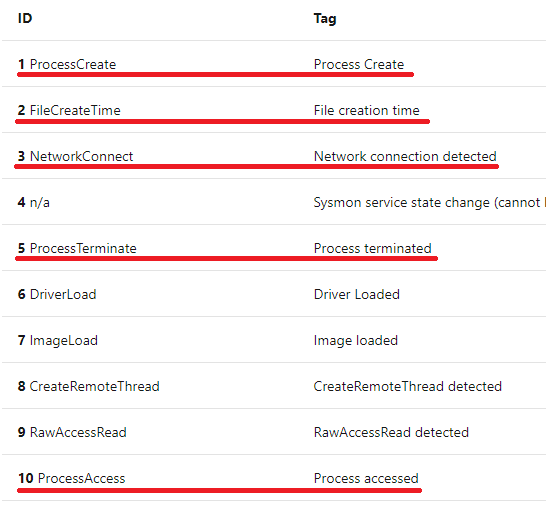
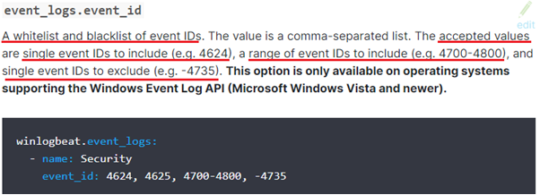
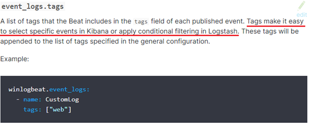
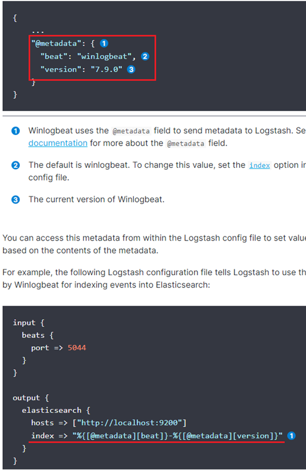

# 원격 근무자 PC agent log 기반 업무 몰입도 기술 개발
---
## 1. 과제의 목표 및 범위 추가 고민 필요

a. 부정행위, 이상행위의 차이 이해 (의도한 행동 or 의도하지 않은 행동의 차이)

-> 온라인 강의 및 시험과 같은 기술일 경우 중요한 포인트! 이 경우에는 시험 및 강의 외의 프로세스 동작 시 문제가 발생한다.

프로젝트의 원격 근무자의 업무 효율적 몰입도 관련 부분에서 업무 프로그램을 사용하지 않는다면 전부 이상행위로 판단 하에 Blacklist방식이 아닌 Whitelist와 같이 업무 프로그램 외에 적절한 기준을 두어 업무 프로그래밍 및 whitelist 외의 프로세스 동작 시 문제 발생은 어떠할지.

업무 프로그램, Whitelist : Slack, Chrome…

b. 몰입도를 수치화해서 표현할지? 아니면 몰입도를 결정하는 요인을 각각 정량적으로만 표현할지? (업무 프로그램을 정의해 그 프로그램에 대한 사용시간을 바탕으로 전체 사용시간에 대한 비율로 나타내는 방식)

->업무 관련 프로그램들의 사용 시간의 비율로 몰입도 측정으로 결정된 사항은 객관적인 지표로 사용 가능할 것 같고 이용자들의 업무 프로그램 사용 시간 비율로 몰입도의 상대적 차이를 비교하기엔 좋은 지표로 사용 가능할 것 같다. 절대적 몰입 수준을 결정하기에는 업무 관련 프로그램들에 가중치를 두어 계산식을 통해 몰입 수준을 측정해야 할 것 같다.

이를 통해 몰입도 측정에 실무에서 직접 사용될 경우 여러 인원의 업무 진행에 있어서 어느 정도의 하한선을 절대적 업무 수준을 결정하고 최소 업무 수준을 넘은 경우 여러 인원별로 몰입 수준 비교를 통해 몰입도를 측정하면 좋을 것 같다.

c. 업무를 한다고 하면 어떤 프로세스가 동작하고 있어야 업무를 한다고 할 수 있을까?

->업무 관련 프로그램 및 기존에 설정해둔 Whitelist를 두어 실행 프로세스를 관리 및 통계

업무 몰입 수준 결정에서는 업무 관련 프로그램은 우리 프로젝트를 적용되는 분야별로 상이하므로 적용 분야별 원하는 세팅을 설정할 수 있도록 해야 할 것 같다. 이부분은 배포 및 프로젝트 적용의 영역에서도 결정해야 할 문제

 
d. 프로세스 동작을 통해 업무 몰입도를 측정하기 위한 추가적인 근거가 필요하다

-> 여러 방안이 있을 것 같고 원하는 해결 방안을 실제로 구현 가능한지 또한 원하는 기준에 해당하는 로그를 출력하는지를 아직 모르기 때문에 이 부분은 차차 진행하며 기록된 로그 분석과 로그 필터링 과정을 익히며 결정해야할 듯하다. 하지만 경진이가 말한 것과 같이 외부 입력에 반복적인 수행이 없거나 업무 프로그램을 진행하는데 프로그램을 진행 시 꾸준한 프로그램의 프로세스의 로그를 전송한다면 해당 프로그램의 프로세스 로그의 공백 구간과 같이 다양한 방안이 존재할 것 같다. 실재로 구현이 되는 부분인지 먼저 알아야 할 듯

e. 위 제시된 수행되는 프로세스의 관점이 아닌, 반대로 접근/접속하지 말아야 하는 Blacklist 방식의 몰입도 계산을 하는 것

->이 부분은 몰입도 기술에서 제일 처음 말한 부정행위 및 이상행위에 해당하는 부분으로 따로 Blacklist의 접속 현황을 출력하는 것, 아니면 몰입도 계산에 Blacklist의 프로세스 사용 수준은 몰입도의 마이너스를 주는 요인을 통해 최종 몰입도에서는 아래와 같이 설정하는 방법도 좋은 기준일 수 있다.

업무 몰입 수준 = ( 업무프로그램 * α )  + ( Whitelist * β )  – ( Blacklist * δ )  [α, β, δ는 적절한 가중치 설정]

---
## 2. 원격 사용자의 업무 PC Log 수집 방법

먼저 client쪽에 원하는 로그 수집을 위해 sysmon설치와 설정, winlogbeat 설치와 적절한 설정파일로 배포 및 로그 전송이 필요할 것 같다.

client쪽에서 적절한 설정을 해둬서 알아서 적합한 로그를 전송, 로그 인덱스패턴과 같은 설정을 미리 설정되어 전송되도록 하는 것이 좋지 않을까

원격 근무 환경에서는 대부분은 근무 시간이 정해지지 않고 해당 업무 수행을 목표로 진행하여 예를 들어 오늘 하루는 내내 휴식을 진행하고 다음날에는 밤새 업무를 진행이 가능하다는 말

이를 통해 로그 수집을 어떻게 해야 할지 결정해야 할 것 같다. 기준을 한달 혹은 일주일과 같이 정해 그 기간에 쌓인 로그를 한번에 전송하여 분석하도록 하면 쌓인 로그를 정해진 날에 winlogbeat와 같은 beats로 실시간으로 매번 전송하지 않고 로그 전송 날에만 사용할 수 있도록 해야하는 것인가? 

---
## 3. HOST에서 동작하는 프로세스 정보 수집을 위한 SYSMON

SYSMON을 개인에 설치가 되면 시스템에 상주하여 시스템 활동을 모니터링 및 이벤트 로그에 기록을 한다.

개인의 sysmon에 원하는 Conf.xml파일을 통해 event filtering을 수행하고 원하는 로그를 필터링을 통해 로그 기록이 가능한 것 같다.

아직 정확한 부분을 숙지하지 못한 상황으로 sysmon에서 필터링 logstash에서의 필터링 winlogbeat에서의 필터링이 각각 어느 수준의 필터링과 적절한 기능을 수행하는지 모름

---
## 4. HOST에 생성된 로그를 ELK에 전달하기 위한 로그 수집 방안

Winlogbeat에서도 또한 로그 전송에 configure파일인 winlogbeat.yml파일 설정이 중요할 것

https://www.elastic.co/guide/en/beats/winlogbeat/current/configuration-winlogbeat-options.html#_configuration_options (elastic winlogbeat conf파일 설정)

이와 같이 event id중 whitelist와 blacklist를 설정하여 포함할 event id와 그 범위 혹은 제외할 event id를 설정할 수 있다.

tag설정을 통해 키바나에서 특정 이벤트를 쉽게 선택하거나 logstash에서 conditional filtering이 가능하다고 함

또한 @metadata 설정을 통해 logstash에서의 ES로 전송시 인덱싱을 설정을 도와준다.

위의 인덱싱 결과 winlogbeat-7.9.0. 으로 ES로 전송이 될 것.

위와 같은 인덱싱은 winlogbeat에서 우선적으로 template setting을 통해서도 가능하다.

---
## 5. 수집된 로그 저장 관련

a. 어떤 Log를 수집해야 하는가? (부정행위, 이상행위 관련 log)

->어떤 로그를 수집할지 수집된 로그 중 어떤 로그를 필요로 하여 출력할지 이는 필터링을 통해 원하는 로그를 전송하는 방법도 있고 필터링된 로그 중 원하는 로그를 키바나에 시각화를 통해 자체적으로 원하는 로그의 데이터를 출력이 가능하다. 이 때문에 어떤 로그를 수집하는가 에서는 기본적으로 필요한 프로세스를 제외하고 업무 프로그램 및 추가 프로세스를 입력받도록 하는 것이 좋지 않을까

b. 필요한, 불필요한 로그는 어떻게 정의할 수 있을까?

-> 이 부분도 진행하며 결정해야할 문제 같은데 불필요한 로그는 기본 시스템 동작에 실행되는 프로세스들? 뭘 하든 동작하는 프로세스들은 업무 몰입도 판단 기준에 포함되지 않으므로 추가적으로 다른 것이 무엇이 있을지 고민해보고 결정해야 할 문제

필요한 로그는 업무 프로그램 및 추가 프로세스 blacklist나 whitelist와 같은 프로세스를 통해 업무 몰입도 수준 평가에 판단 기준이 되는 프로세스들로 구성이 될 것 같다.

c. 수집된 로그 및 활용에 따라 ‘사용자의 부정행위’ 외에 보안에 해당되는 ‘PC이상행위’ 모니터링 범위까지 더 넓게 응용하여 활용 가능함

-> 이 부분은 외부 침입과 같은 부분 같음. 먼저 우리 프로젝트에서 업무 몰입도 기술이 완성이 된다면 추가적으로 악성코드 및 보안 관련된 부분을 추가할 수 있으면 좋은 기능일 것 같다?

---
## 6.기술적 문제 외, 법/제도 준수(컴플라이언스)요건에 대한 영향도 검토

흠 이 부분은 기술적인 문제가 해결이 되면 문제를 해결할 수 있지 않을까?

법,제도 준수 요건은 아예 모르겠네 그냥 프로젝트 업무 몰입도 프로그램을 사용하면 기본적으로 log수집 동의가 필요하므로 프로그램 설치 시에 해당 부분은 해결이 될 것?같다.
