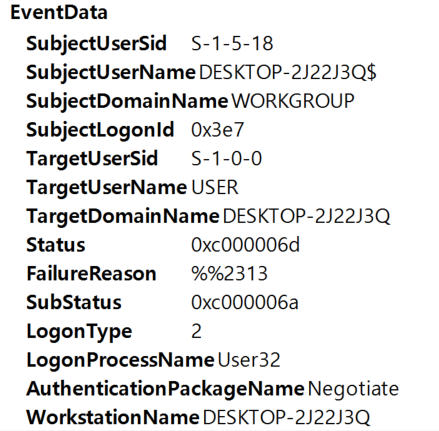

# SIEM으로 18가지의 악의적인 Active Directory 탐지

## * FAILED LOGIN VARIATIONS (4625)

## 1. FAILED LOGINS FOR USER

- Event ID = 4625
- X number of failed logins in X minutes with the same username

동일한 User로 X분동안 X번 로그인에 실패한 경우

탐지 : Event ID가 4625이면서 동일한 유저로 로그인 시도중 N시간동안 X번의 실패를 감지

TargetUserSid에 실패한 횟수를 통해 시각화가 가능할 것 같다.

## 2. PASSWORD SPRAYING

- Event ID = 4625
- Same Source
- 2 or more usernames within X minutes

같은 Source에서 2개 이상의 user에 접속하려고 할 경우

탐지 : Event ID가 4625이면서 같은 사용자가 여러개의 user로 접속하려고 시도하는 경우

이건 SubjectUserName이 시도한 TargetUserName을 종류별로 시각화하면 되려나?

## 3. ATTEMPTED DISABLED ACCOUNT USAGE, ATTEMPTED EXPIRED ACCOUNT USAGE

- Event ID = 4625
- Sub Status Code is 0xC0000072
- Sub Status Code is 0xC0000193

비활성화된 계정에 로그인 시도, 만료된 계정에 액세스 시도

탐지 : Event ID가 4625이고 sub Status가 0xC0000072 or 0xC0000193인 경우

이벤트 발생시 사용자별 substatus를 검색하여 시각화 가능

## * MALICIOUS SUCCESSFUL LOGINS (4624)

이상한 성공적인 로그인 탐지

## 1. NON ALLOWED ACCOUNT

- Event ID = 4624
- Logon Type is 2 or 10 
- Username matches expression ^SVC.* or .*\$$

탐지 : logon Type이 2나 10인데 Username이 ^SVC.* or .*\$$인 경우

헷갈리는건 Username이 Subject인지 Target인지 모르겠는데 느낌상 계정의 문제이므로 TargetUserName이지 않을까?

## 2. LOGONS DIRECTLY TO DOMAIN COntroller

