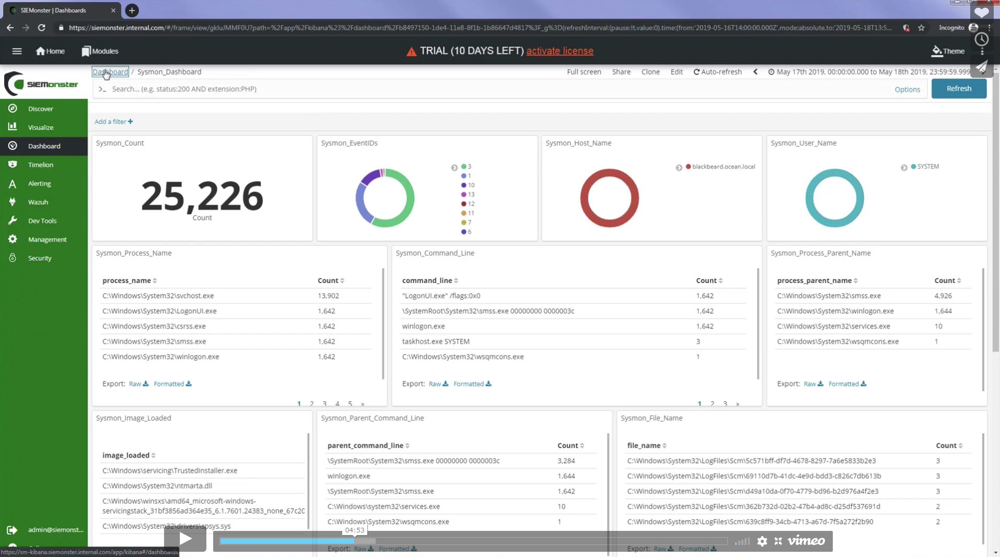

# SIEM

## Learn SIEM

SIEM으로 네트워크의 다양한 소스에서 데이터 수집 -> 데이터 정규화, 인덱싱, 집계

- 내부 기능 보고, 위협 탐지 및 기타 다양한 작업에 이용

SIEM의 작동 방식 및 사용 방법을 이해하는 것이 중요하다.

1. SIEMonster

오픈소스 SIEM인 SIEMonster

사용되는 기능들
https://siemonster.com/videos/

위의 영상을 보고 프로젝트 제작에 참고용으로 도움이 될 것 같다.

---
# Threat Hunting

Window Event System에는 파워쉘 이벤트나 DNS 이벤트와 괕이 악성 프로세스의 이상 행위를 모니터링할 수 있는 여러 이벤트가 존재.

하지만 보안을 위해 만들어진 시스템이 아니라 원하는 정보가 빠져있다.

이 때문에 sysmon을 추가하여 풍부한 이벤트를 종합한다. 일반적인 상용 EDR은 직접 개발한 커스텀 센서를 사용하지만 우리 프로젝트에선 제한사항이 크므로 window event와 sysmon의 로그를 활용

해당 로그를 winlogbeat를 활용하여 Elastic  stack에 적재가 가능

- Threat Hunting

위협 탐지를 위해 Elasticsearch에서는 Kibana를 활용하여 데이터를 찾고 시각화로 활용

