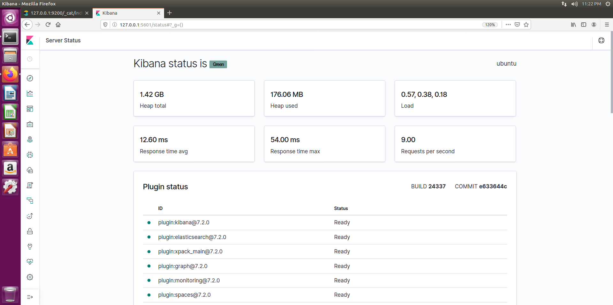

# 키바나를 활용한 시각화

## 1.	시각화 도구 Kibana 튜토리얼

elasticsearch와 함께 동작하고 동일한 버전으로 사용하기!

   http://127.0.0.1:5601/status로 키바나의 상태 확인 가능



여러 플러그인들이 default로 설치가 되어 있다.


이와 같이 키바나에서 elasticsearch를 관리할 수 있다.


키바나를 통한 로그 다운로드된 패턴이 되어 있고 새로운 패턴도 정의하여 할 수 있다. 


패턴 설정 first step

이와 같이 패턴이 정의가 되지 않은 것들은 새로운 패턴을 정의할 수 있고 만약 로그를 logstash로 데이터를 받는 경우 index pattern에 logstash를 작성하면 활성화가 될 것이다.


second step

time패턴을 설정

타임 시리즈 : 시계열

데이터를 분석할 때 시간에 따라 분석을 할 수 있는 데이터(시계열데이터) ex:주식, 시세, 로그, 등..


패턴을 생성하면 알아서 매핑을 어떻게 했는지도 알아서 설정해 준다.

departure_date와 같은 데이터는 날짜인 것을 알고 미리 date의 type으로 설정이 된다.


데이터 조회를 키바나에서 활용
 
## 2.	시각화할 데이터 매핑하기

https://www.elastic.co/guide/en/kibana/7.2/tutorial-build-dashboard.html#tutorial-load-sample-data

예제 데이터 다운

```
curl -O https://download.elastic.co/demos/kibana/gettingstarted/8.x/shakespeare.json

curl -O https://download.elastic.co/demos/kibana/gettingstarted/8.x/accounts.zip

curl -O https://download.elastic.co/demos/kibana/gettingstarted/8.x/logs.jsonl.gz
```

데이터 매핑


```
curl -u elastic -H 'Content-Type: application/x-ndjson' -XPOST 'localhost:9200<port>/bank/_bulk?pretty' --data-binary @accounts.json

curl -u elastic -H 'Content-Type: application/x-ndjson' -XPOST ' localhost:9200/shakespeare/_bulk?pretty' --data-binary @shakespeare.json

curl -u elastic -H 'Content-Type: application/x-ndjson' -XPOST ' localhost:9200/_bulk?pretty' --data-binary @logs.jsonl
```

bulk로 데이터 로드


logstash의 데이터 패턴을 입력 시 시계열 정보를 설정해야 하므로 @timestamp로 한다.

@: logstash가 데이터를 수집한 시간

utc_time : 로그가 생성된 시간 ( 일반적으로 @인 데이터 수집한 시간과 대부분 동일하다.)


매핑시 geo포인트는 float형이 아닌 geo_point로 매핑이 되어 있는지 확인한다. 이를 통해 visualiztion을 통해 맵을 그릴 수 있다.

## 3.	Kibana를 활용한 시각화

visualize의 metric : 간단한 숫자 관련 시각화

default로는 개수(count)이고 설정을 통해 다양한 출력이 가능


로그가 몇 개 발생했는지 등 count를 통해 설정

visualize를 생성하고 대쉬보드(기록을 관찰하는 공간)를 통해 꾸미기가 가능

pie chart(통계적인 부분을 시각화에 도움을 준다)


pie를 split하여 시각화의 옵션에도 다양한 기능이 있고 range를 통해 실습한다.


split할 범위를 지정하고 어떤 정보를 split할지 설정해야한다.


sub split을 통해  이와 같이 새로운 차트도 출력이 가능하다.


vertical bar를 통해 x및 y축을 설정하여 시각화가 가능


데이터 시간을 적절하게 설정해야 데이터 기록 정보를 확인할 수 있다.

실습 최종 대쉬보드


